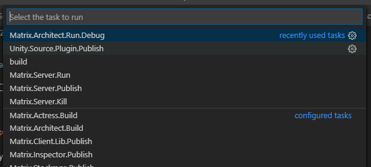

# ZP Workspace 

一个完整的ZP源码工程

## 目录结构

- ZP.Lib [ZP.Lib](./ZP.Lib/Readme.md)
- ZP.Matrix [ZP.Matrix](./ZP.Matrix/Readme.md)
- ZProRx.Test.Unity ZP基本的Demo
- Dudu.Unity Dudu案例Unity Client端工程，ZP.Lib 以源码的形式Plugin。
- ZP.Server.Demo 为Dudu案例 Soc Server端工程及源码。
- ZP.Server.Demo 为Dudu案例 Web Server端工程及源码。
- .vscode VS工程的设置文件，如下包括了一些开发中使用的Task，如Unity.ZP.Lib.Plugin.Publish用于发布源码到指定的Unity应用中。主要用于基于GitHub源码进行开发。

由于开源进度的原因，以上目录可能包含不全。

Unity工程目前要求是要与ZP.Lib在同一目录下，
通过Task 实现把Plugin 注入到Unity工程中。

## RTM

### [v0.7]

[2019-10-12 11:13:39]
1. Unity的工程位置的问题，需要判断新的Plugin 工程机制

