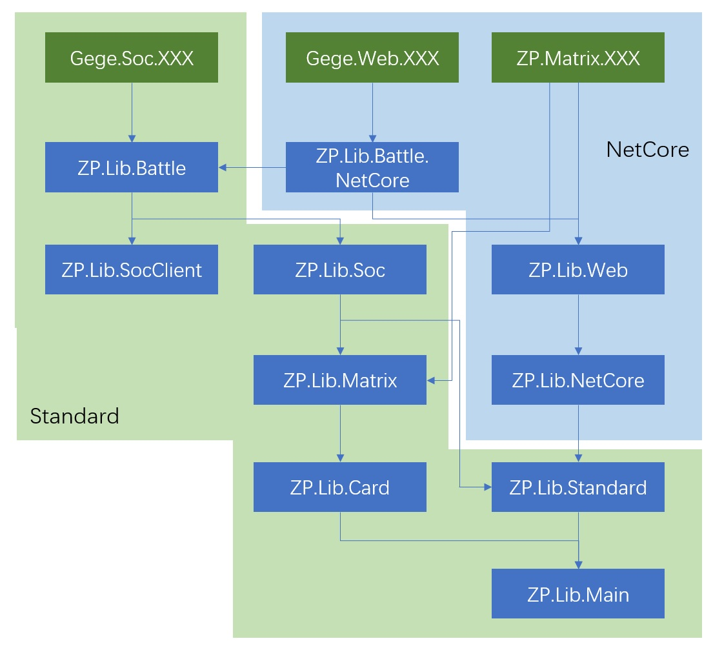
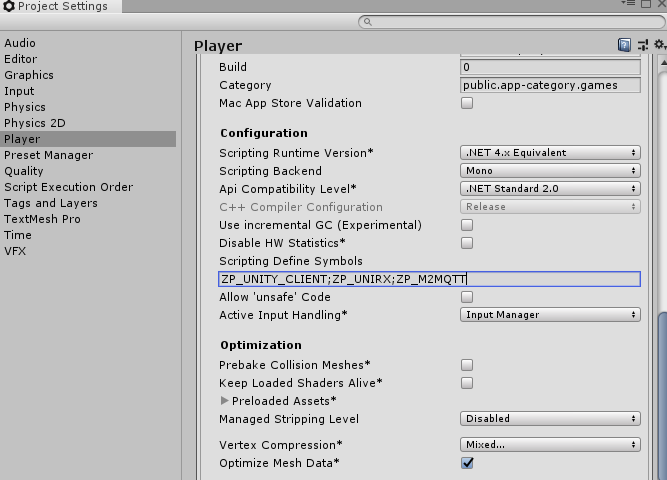

# ZProRx.Lib

## 目录
- [ZProRx.Lib](#zprorxlib)
  - [目录](#%E7%9B%AE%E5%BD%95)
  - [ZProRx 框架简介](#zprorx-%E6%A1%86%E6%9E%B6%E7%AE%80%E4%BB%8B)
    - [各模块简介](#%E5%90%84%E6%A8%A1%E5%9D%97%E7%AE%80%E4%BB%8B)
  - [Framework 架构](#framework-%E6%9E%B6%E6%9E%84)
    - [统一语言](#%E7%BB%9F%E4%B8%80%E8%AF%AD%E8%A8%80)
    - [共通宏定义](#%E5%85%B1%E9%80%9A%E5%AE%8F%E5%AE%9A%E4%B9%89)
  - [Rule 规范](#rule-%E8%A7%84%E8%8C%83)
    - [文件 命名规则](#%E6%96%87%E4%BB%B6-%E5%91%BD%E5%90%8D%E8%A7%84%E5%88%99)
      - [Common](#common)
      - [Reactive](#reactive)
      - [Matrix](#matrix)
      - [Card](#card)
  - [Unity Plugin](#unity-plugin)
    - [Plugin 导入](#plugin-%E5%AF%BC%E5%85%A5)
  - [Asset](#asset)
  - [Demo 应用案例](#demo-%E5%BA%94%E7%94%A8%E6%A1%88%E4%BE%8B)
  - [Other 其它](#other-%E5%85%B6%E5%AE%83)
  - [RoadMap](#roadmap)
  - [License](#license)

## ZProRx 框架简介
面向属性的编程框架，以属性为基础，构建属性网，同时结合反应式编程、链式编程。

特点：
- 基于UniRx反应式的属性框架。
- 基于面向切片的编程思想，通过修饰(Attribute)配合属性，提供附加信息定义，比如：实现属性间的关联
- 支持与View(Unity）的绑定。用于表现层的分离（MVC框架等）。UniRx的ReactiveProperty也有类似的功能。 但ZProRx提供更强大的绑定功能。


### 各模块简介

- [ZP.Lib.Main](./ZP.Lib.Main/Readme.md)
- [ZP.Lib.Standard](./ZP.Lib.Standard/Readme.md)
- [ZP.Lib.NetCore](./ZP.Lib.NetCore/Readme.md)
- [ZP.Lib.Card](./ZP.Lib.Card/Readme.md)
- [ZP.Lib.Matrix](./ZP.Lib.Matrix/Readme.md)
- [ZP.Lib.Soc](./ZP.Lib.Soc/Readme.md)
- [ZP.Lib.SocClient](./ZP.Lib.SocClient/Readme.md)
- [ZP.Lib.Web](./ZP.Lib.Web/Readme.md)
- [ZP.Lib.Battle](./ZP.Lib.Battle/Readme.md)
- [ZP.Lib.Battle.NetCore](./ZP.Lib.Battle.NetCore/Readme.md)

注：以上目前暂时开源了ZP.Lib.Main模块，即ZP的核心模块，后续将陆续开源其它模块。

--------------
## Framework 架构
	
ZP系的库文件结构树，如下图所示，可以看到各产品的依赖关系。



只简单解释以下几个模块
- ZP.Lib.Matrix 模块，基于ZP的应用中间件，支持Socket、Web等功能模块。
- ZP.Lib.Soc 基于Socket的网络框架，包括了提供Channel、Pipeline等模块，简化网络相关的开发过程。
- ZP.Lib.Battle 基于ZP的网络对战引擎。

### 统一语言
 * ZP 为ZProperty框架的简写。后续文档以ZP表示ZProperty框架
 * Soc 是Socket后端服务应用的缩写，主要用于基于TCP/UPD协议的Server端开发，比如，应用于游戏对战服务。本框Soc模块引入Room（房间）的概念对Socket进行封装。
 * SocClient 是运行于Soc服务框架之上，
 * ZProperty< Value > ZP属性定义为模板类，其模板参数T为属性“值”，ZP框架提供了常用的Value类，参考./ZP.Lib.Main/Src/Values目录。
 * ZP类，即包含了ZP属性定义的类。


### 共通宏定义
```csharp
	#define ZP_UNITY_CLIENT //Unity Client
	#define ZP_UNITY_SERVER //Unity Server 用于使用Unity 客户端对Server进行模拟测试。
	#define ZP_SERVER // Server 用于使用.NetCore端对Server
```

## Rule 规范

### 文件 命名规则
文件名后缀规则

#### Common
- Enum 枚举定义
- Struct 结构体定义
- [Class]Extension 某一类Class的扩展。
- Attribute 属性类定义
- Tools 工具类定义，一定相关功能的集合

#### Reactive
- Observable RX 被观察者 类定义，与UniRX、Reactive中，追加的Observable类型。如果有明确的操作性，文件名以OperatorObservable进行定义，如果文件中只有一个类的定义使用类名命名文件名。
- Observer RX 观察者定义
- ObservableExtension 用于扩展对IObservable操作，返回的一般是Operator

#### Matrix
- Property ZP类定义，至少派生至IZProperty或者ZProperty，对于ZP Value 类，不要使用的Property命名
- Value ZP属性值类
- ViewItem 用于ZP对象的可视化类定义。

- Channel 通道类定义
- Pipeline 管道类定义，用于Client端，Server端使用Channel定义。 
- Agent Round或者SyncFrame Pipeline的代理类，是每一个Client的代理，用于接收消息。

- Link 用于数据库的访问，Link是与实体类关联的对象类，比如：包含一些附加的信息。参考如下：Darder类的定义。

#### Card
- Card
- Basexxx 
- Stat 是Unit的一统计视图，用于统计Unit或者Ballte的数据信息。

```csharp
    [PropertyGroup("Cards")]
    [PropertyUIItemRes("DuduItems/CardLinkItemV", "Root")]
    ZPropertyList<DardLink> dardLinks = new ZPropertyList<DardLink>();
```

----------------------------------

## Unity Plugin
ZProRx.Lib 做为Unity的Plugin导入到Untiy 应用中。
主要包括：ZP框架、ZPMatrix框架

并提供Plugin下载
/Plugins/ZP.Lib/ZP.Lib.Main
/Plugins/ZP.Lib/ZP.Lib.Card
/Plugins/ZP.Lib/ZP.Lib.Matrix
/Plugins/ZP.Lib/ZP.Lib.Battle
/Plugins/ZP.Lib/ZP.Lib.Unity

本Plugin依赖并集成两个第三方Plugin
/Plugins/LitJson.dll
/Plugins/M2Mqtt.dll

另外，还依赖UniRx，需要自行下载并安装。可以在Assets Store 搜索 UniRx。

注：由于部分开源的原因，以上陆续更新中。

**【工程设置】**
需要设置ZP_UNITY_CLIENT;ZP_UNIRX;ZP_M2MQTT 在PlayerSetting中




### Plugin 导入

- 基于ZP.Lib源码开发，可以使用的VS Code 的Task Unity.Source.Plugin.Publish （参数为Unity 工程）
  对于只包括ZP.Lib.Main模块的，使用的Task Unity.ZP.Lib.Plugin.Publish

- 基于ZP.Lib的库文件开发，从官网下载最新的UnityPlugin文件，安装。

以上两种情况最终都会在Assets/Plugins/目录下安装ZP.Lib的几个模块的代码。


## Asset
应用使用的资源，Web端、Soc端、UnityClient端共通使用，延用Unity的目录结构与名称。主要资源类型包括：
Jsons、Unity资源等。

参考如下主要的目录结构，这里推荐使用的App目录进行管理。
```csharp
public sealed class  ServerPath : PropObjectSingleton<ServerPath>
{
    public static string WorkPath = "../..";  
    public static string AppName = "ZProApp";
    public readonly string ASSETS = $"{WorkPath}/Assets/";
    public readonly string APP_ASSETS = $"{WorkPath}/Assets/{AppName}/";
    public readonly string RESOURCES = $"{WorkPath}/Assets/Resources/";
    public readonly string APP_RESOURCES = $"{WorkPath}/Assets/Resources/{AppName}/";

    public readonly string JSONS_PATH = $"{WorkPath}/Assets/Resources/{AppName}/Jsons/";
    public readonly string SCENE_ROOT = $"{WorkPath}/Assets/Resources/{AppName}/Jsons/Server/";
    public readonly string PREFABS = $"{WorkPath}/Assets/Resources/{AppName}/Jsons/Server/Prefabs.json";
    public readonly string GALAXYAREAS = $"{WorkPath}/Assets/Resources/{AppName}/Jsons/Server/Map/";
}

```

主要配置方法：
- Unity Client使用的默认的配置
- 用于Soc应用，通过Setting.json文件

```json
  "AssetConfig": {
    "AssetPath": "",
    "AppName":"Dudu",
    "Scenes": [
      {
        "Name": "Scene3"
      }
    ]
  },
```

其由UseMatrix自动加载（包括Web端和Soc端）
- 通过方法`UseAssetPath`分别在定义在`AssetAppBuilderExtensions`类中,其会由`UseMatrix`自动调用。

Unity端可通过
RoomMatrixBehaviour的AppName进行指定，默认为"ZProApp"

## Demo 应用案例
 - [ZP.Server.Demo一个Soc端服务](../ZP.Server.Demo/Readme.md)
   - 其主要功能是一个简单的回合制小游戏
  
 - [ZP.WebServer.Demo一个WebServer端服务](../ZP.WebServer.Demo/Readme.md)

注意：后续开源中。。。

## Other 其它
Tools 目录：主要包括了一些配合VSCode Task 使用的一些Shell脚本文件，目前支持Windows、Mac。
ClientLibrary: Client端依赖的库文件
ServerLibrary目录：Server端依赖的库文件，
- UniRx为通用版本，即不支持Unity的扩展。Unity客户端还请从Asset Store 下载UniRx免费插件。
- UnityEngine.CoreModule.dll 为Server端使用的Unity库文件，这里通过编译注入进行了修改，屏蔽了一些在Server端无法使用的类，如GameObject。会根据Untiy的大版本进行定期更新。

## RoadMap
1. [v0.8] 基本功能，与ZProRx.Matrix版本同步，即完成ZProRx.Matrix相应版本的功能。
  - 资源管理类进行统一处理，支持动态更新、版本控制、缓存、前后端差别（Resource.Load时 Unity不能带扩展名）
2. [v0.81] 支持NetCore 3.0, 模块整理, HTTP 错误码支持。
3. [v0.82] Pool模块支持池化。TestCase 对应xUnit
4. **[v1.0]**  1.0版本对外开放，对Unity更好的支持，包括Unity Plugin以及工程优化，支持更多的TriggerComponent
5. [v1.09] 非功能性需求对应，使用的AOP对应，主要功能包括
   - 事务 - 缓存 - 日志 - 安全
6. [v1.1] Net优化与扩展，支持除MQTT外的Socket框架。支持Component的绑定功能。
7. [v1.2] 后端物理引擎完善（Box2D？），Server端替换到UnityCore相关的依赖
8. [v1.3] 坐标系统后续考虑更多布局的支持，比如，六边形。Unity资源优化，支持Scene文件自动输出为Json。
9.  [v1.4] gRPC支持，调用Soc端


## License
	 ZProRx.Lib 开源源码遵循 [MIT](LICENSE) 开源协议。
