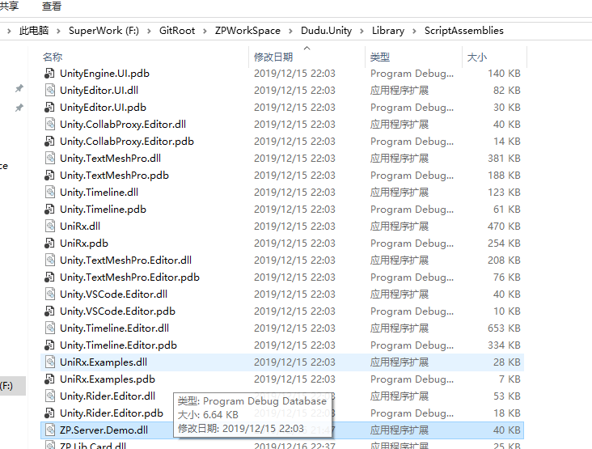
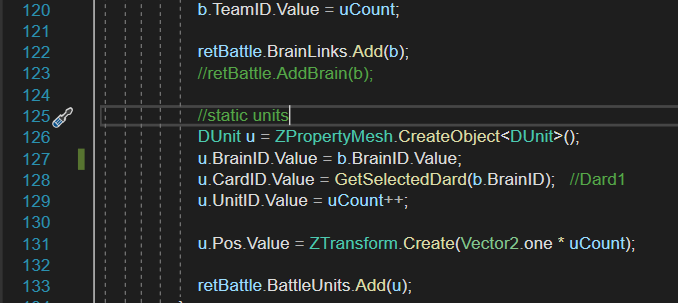
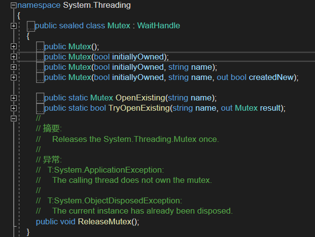
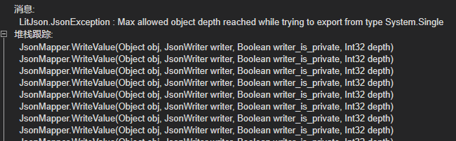

# DevLog for ZP.Lib.Main


#### 后续功能
1. [Fixed]通过ZP自动生成数据库代码。
2. [v1.1]PropertyLink 可以指定变换方法。
3. [Fixed]**网络**如果Post等操作失败，超时如何进行处理？返回对应的异常
4. [v0.81]对象池化对应
5. [TBD]关联方法引入类型Ling串联的调用方式？？
6. [v0.8]HTTP 错误码支持
7. [v0.8]用户密码安全问题
8. [v0.81] 支持UI属性的绑定
9. [v0.8] 统一事件处理，支持多层次的事件追踪、订阅。以ZEvent为基础
10. [v1.0] Server 端未支持UniRX的Trigger 扩展，比如使用的`UpdateAsObservable`这种方式。当然Unity 工程中还是可以使用的
11. [v1.1] 自动Check 代码工具，比如如下的问题[19]
12. [v0.8] 通用的异常处理
13. [v0.8] Host Map 需要通过Configuration文件进行导入，目前只支持了一个(localhost)。
14. [v0.8] 需要对应各UI的Description的功能。
15. [v0.8] 需要支持Channel Action的串行的标签。
16. [v1.0.6] Web 也应该支持类似SendPackage2这种，以String为Error的通用错误处理。

#### 目前问题
1. [Fixed]ZNetErrorEnum 等RX对象的错误处理未完善。可以通过UniRx的.Catch方法进行接收。
2. [Fixed]Socket 返回值 Topic目前调用了 UnSubscribe，
   [Fixed]但对应的SubJect还未进行处理, 同时还需要支持在返回的IDisposable 对象调用Dispose自动 UnSubscribe [2019.08.09]
   
3. [1.0]Assembly 是否需要一个管理类，Load后，再调用时是否是重新加载，在BindComponent 中加载。【2019.08.14】
4. [Fixed][1.0] ObservableEx.NextFrame()还不能在当前Server线程中调用。【2019.08.14】
5. [Fixed][1.0] JsonLitRawData 中把Map转换为`IRawDataPref`，在多层的结构中可能会有问题。
6. [Fixed][1.0]工程中Unity原生依赖，自带版本号的升级的问题还没有解决，使用的asmdef文件定义工程，直接把工程放到Plugin 目录中。
7. [Fixed]Log使用NLog的方法进行输出，参考Supervisor中的做法。
8.  [1.1]Mysql中还不支持第二个Index的创建。这样性能会有问题。
9.  [Fixed]目前使用MQTT的对象太多了，如果一个Soc中有多个Client的话，就会出现成倍的增长。**注注注请注意**
10. [Fixed]目前对于SendWithResult的，Topic只是使用的添加后缀 `/Result`的方式，这样如果在Server端会出现问题，只能有一个接收者。
参考以下截图，目前客户端发现Start命令，只有能一个接收到回复。


使用的并行与串行的方式进行分别处理。

**后续修改:**需要修改为BaseChannel中Open的方法，按各个情况分解函数。同时DoActionWithRawResult，需要与DoActionWithResult使用的相同的机制进行修改。

11. [Fixed][TODO] UniRx ToObservable目前的版本还不支持，应该是Build过程中出现的问题，需要使用Standard2.0进行Build UniRx
    
12. [Fixed][Bug]Rx规范对应，处理完的事件，要调用OnComplete。

13. 2019.2 升级问题
    - BindDebugEvent暂时删除了
    - 以下命令不好用
  ```csharp
    <Target Name="PostBuild" AfterTargets="PostBuildEvent">
      <Exec Command="xcopy /r /y $(OutDir)LitJson.dll ..\Assets\Plugins&#xD;&#xA;xcopy /r /y $(OutDir)ZP.Lib.client.dll ..\Assets\Plugins&#xD;&#xA;xcopy /r /y $(OutDir)ZP.Lib.client.pdb ..\Assets\Plugins&#xD;&#xA;xcopy /r /y $(ProjectDir)ClientLibrary\M2Mqtt.dll ..\Assets\Plugins" />
    </Target>
  ```

14. [Fixed]**CancellationToken Support**: Task & Observable的取消状态对应，一些Task需要取消的，类似之后通过Flag进行取消。
[参考](https://www.cnblogs.com/zhengzc/p/8508889.html)

主要IDisposable与CancelToken的关系。如果返回Task就要考虑Cancel的支持，如果返回的是IDisposable,其内部可能会集成CancelToken的支持。

使用的`ToCancellable` 方法，进行返一个可以取消的`Observer`，其可以获取到一个`CancellationToken`，用于Task等资源的取消。

【2019-11-15】
[TBD]目前Lib.Main的`Task.run`已经对应完毕，其它模块的还未进行对应

【2019-11-15】
[TBD]还有大量的new Task 还未进行对应

15. 网络订阅API（包括Socket与Http）都是不支持同时对同一个Url进行订阅，如果订阅了，也只有一个收到消息。
引入支持计数功能的Observable类。

【2019-11-15 11:23:36】
Net 相关API可以调用多次，现在不再使用的Subject List了。
[TBD]Socket Receive 还不能调用多次，Post可以调用多次。

16. [Fixed]=Core/Relation/ZPropertyEx 中很多关联的方法，返回值还未支持IDisposable

【2019-11-15】[Fixed][TBD] 对应测试用例时进行对应
- [Fixed]有大量的`OnValueChanged`没有进行处理，需要使用`OnValueChange` 进行替换。
- [Fixed]ZPropertyEx 中的Sum/listItemValueChanged还未进行对应。

[2020-01-17][Fixed] [TODO] 还有大量使用，List OnAddItem 没有进行UnBind的问题。
[Fixed]另外，LinkProperty 的如何进行Dispose也未进行对应。 在SetLink时进行释放
[Fixed]Event UnBind未对应

17.  Interface.Type 目前也有可能是从Dll载的情况， 由Interface.AssemblyPath来进行定义

[2019-11-15]
[TBD]目前其它工程的Card.json定义还未对应

[2019-11-16]
这个有一个问题，`Dudu.DuduWeapon`应该是Unity本身的工程中加载，为啥还是获取不到啊？因为是在ZP.Lib.Main里吗？
AssemblyDll的加载需要有一个顺序，进行默认加载。
需要还需要把一些其它的Dll Copy到对应的目录下。
如：ZP.Server.Demo.dll



18. ZPropertyObservable 命名，不是很统一。有扩展又有Create的过程。还是优先进行扩展。对于那种带有参数的，可能需要使用的Create的。

19. [v1.1]对于Attribute `SyncResultAttribute` 修饰的方法一定要是有返回值，目前还没有这方面的一个代码Check。 [2019-12-22]

20. [Deferred]为啥Sync的同步未返回时，Lock一个对象会阻塞呢？
[TBD]
[2019-12-23] 临时回避了这个问题。不知道后面是否还会遇到。

21. [Fixed]TestRuntimePipeline 这里使用的 this.WaitConnected(1) 用来等所有用户加入后，再来选卡。

22. [Fixed]"onclientconnected" 有几处的Send，没有进行Subscribe，那其不会触发的。还需要进一步的确认


23. [CheckList]ZProperty 的直接赋值是很危险的。
    
  

24. [Deferred]ZPropertyPrefs.Save 目前还不支持对Interface对象的保存，即如果Interface其就会跳过这个结点。
  
25. Dispose 方法线程安全性进行统一排查，还有很多不合规的地方，比如，不合理使用Lock，其与Interlocked的使用需要进行区别，
后者也可以起到一个加锁的作用，它只是互斥锁、乐观锁，Lock是悲观锁，主要用于串行化处理。

26. 线程安全需要考虑的地方：
  - ZPropertyMesh 对整个types nodes的操作。
  - ZPropertyJsonLitPrefs 相关的操作，比如Load、Save等。这块应该是调用者需要保证对于单个文件加载时的线程安全问题，这里只会提供对Dll加载池的同步安全问题。
  - 各种List的安全问题，比如`ZPropertyList` 

27. [Deferred]需要支持Config的类，因为RoundChannel中才获取Config。外部还可以统一进行获取。但是只有Server端才能获取到啊，客户端还需要进行返回，比如通过Battle数据返回

28. ZPropertyUpdater 目前看对 Runtime Property 和 RankProperty 支持不友好，其有当前值的概念。对于从文件、网络加载应该不是Runtime的，但对Update需要支持Runtime，目前网络传输也是不支持RankProperty的，一般都是配置文件中加载？

29. [v1.1]物理引擎部分，目前还有一些细节，比如`ContactPoint contact`的支持等。

30. [Fixed] PackageObservableExtension [Fixed] / ObservableWithResponsableExtension [Fixed] 等类 Subscribe未支持OnError 

31. 线程的Cancel还不完整，new Task( 等还有未支持取消的。

32. IEquipable 的Destory还未进行对应。

34. RTBullt还不是Trigger

35. IZPropertyList).OnRemoveItem 还未支持Observable，因为其Action有两个参数

36. [Fixed]需要支持除外 Bind的属性，如下所示，对于通过Radio List绑定时，如果BrainLinks再下面，会出于多次绑定的问题。
即认为其第一次的子结点，为后面BrainLinks的要了。或者是判断是否已经进行过绑定。
```csharp
  [PropertyUIItemRes("DuduItems/BrainLinkItem", "Root")]
  public ZPropertyRefList<BrainInfo> BrainLinks = new ZPropertyRefList<BrainInfo>();

  [PropertyGroup("Main")]
  [PropertyLink(".BrainLinks")]
  public ZLinkProperty<int> CurHandBrain = new ZLinkProperty<int>();
```
  [2020-02-24] 通过追加数组的成员的Name[index]

37. [Deferred][CheckList][v1.0]【重要】ZP类，的基类中如果定义为Private，通过父类目前是无法获取到其定义的属性值的。

38. [Fixed]【重要】SendPackage 的多次的Subscribe会有问题，会有多个Result的Topic，其核心还是 ReceivePackage 是不能多次进行的。
    [CheckList][2020-02-24] 目前 已经支持了SendPackage多次Subscribe的问题，但ReceivePackage 只能要Dispose之后才能再次使用

39. UniRx ToTask 如何 Dispose

40. [Deferred][CheckList][v1.0]PropertyMesh.IsDefineInterface(p) 对于把_ConvertToMap 即转换为Json时，对于值类是接口的ZP对象，目前的式样是停止进行转换的。

41. [Deferred][CheckList][v1.0]【重要】ZEvent 还不支持MultiPropertyId, 即简写的".OnEvent"的形式。

42. 【重要】TTPServer 中的 RecvListeners 还没有进行线程安全的处理。

43. [Fixed]SocBuilding中的判断Connect需要加入 InterAdd 变量进行互斥操作。

44. [Deferred][v1.0]对于Server端Channel的初始化依赖第一接入的Client的定义的Channels

45. [Deferred][v1.0]BindProperty 目前使用的tran.name.Contains(prop.SimplePropertyID) 用于比较匹配，会有问题。

46. UpdateValue 有一些个别的ViewItem中对UpdateValue还不是保证在UI线程上调用的。

47. HTTPClient 中的 RecvListeners 还没有考虑线程安全的问题。

------------------

#### TestCase

##### Base
1. 基本对象的创建
2. 加载一个测试的Json文件确认Json解析是否OK， 需要支持的所有的共通数据类型。需要Test支持加载Dll的情况。
3. 各值对象的使用
  以ZDateTime为例，（优先进行调用次数多的方法进行Test）
4. 各个关联、视图的测试


##### Scene
1. 加载、绑定、Prefab自动创建、生命周期
2. Transform 相关测试
3. 物理、碰撞等

##### Net 
1. Net 的测试，还需要启动一个小的Server。用于接收Post、Get等操作。
2. 测试Socket Receive[xxx]方法，进行反订阅的操作，即在Dispose的时机。时刻查看Subject的个数。这也是一个性能指标。
3. 对于 SyncResult 的方法需要进行测试。分兩個方向。對于向Server端，其要保證只調用一次，并返回多個結果。

##### UI
3. 与UI的绑定、解绑，以及对应事件的接收情况。
4. Channel Action 的各种类型的参数[FromBody]

#### Debug Journal
1. [Fixed]线程安全的问题，如果在使用的Mutex需要在同一线程中获取与Release，否则会出现以下异常。



这时需要使用的`SemaphoreSlim`或者`Semaphore`。前者开销更小。但不用于进程间。


1. Unity线程死锁的问题
```csharp
  runtimeChannel.RequireBattleData().ObserveOnMainThread().Subscribe(battle => BuildBattle(battle));

  //wait for the bind end
  //will deadlock
  //var ret = syncRet.Where(item => item == true).Fetch().ToTask().Result;
```

3. UniRX WhenAll
When All not work it only return when all observer is stopped，
这时对于想接收到两个OnNext消息的情况，可以使用`Fetch` 运算符

如上，如果在Start里使用.Result这种方式等待（阻塞当然Thread，另Unity的Start应该是不支持await的），这个等待在ObserveOnMainThread里面去完成的，那么其就不会被调度，因为这个UI线程在等待中。。。

4. JsonLit 的坑，常常出现如下的错误 Max allowed object depth reached while trying to export from type System.Single
   
  

---


### Release
一定要使用.nuspec 文件
dotnet pack .\ZP.Lib.Server.csproj -p:NuspecFile=.\ZP.Lib.Server.nuspec