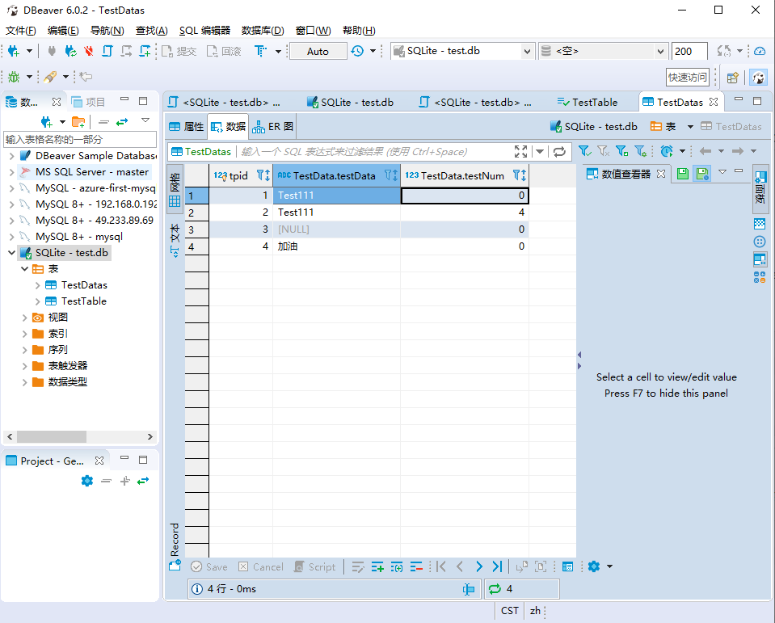

# ZP.Lib.Server.SQL

## SQLite 帮助文档
https://www.runoob.com/sqlite/sqlite-create-database.html

## 环境安装


 

## 代码开发

使用的如下的SQLite官方C# 开发库。


其一些命令与Mysql还是有不同的

- 连接字符串
"Data Source=D:\\SQLite\\test.db"

参考如下配置：

```json
  "ConnectionStrings": {
    "mysql": "server=127.0.0.1;Port=3307;userid=root;password=123456;AllowPublicKeyRetrieval=True",
    "sqlite3": "Data Source=D:\\SQLite\\test.db"
  },

```

- 获取上次加追加的ID
 var newIndex = sqLiteConnection.LastInsertRowId;
