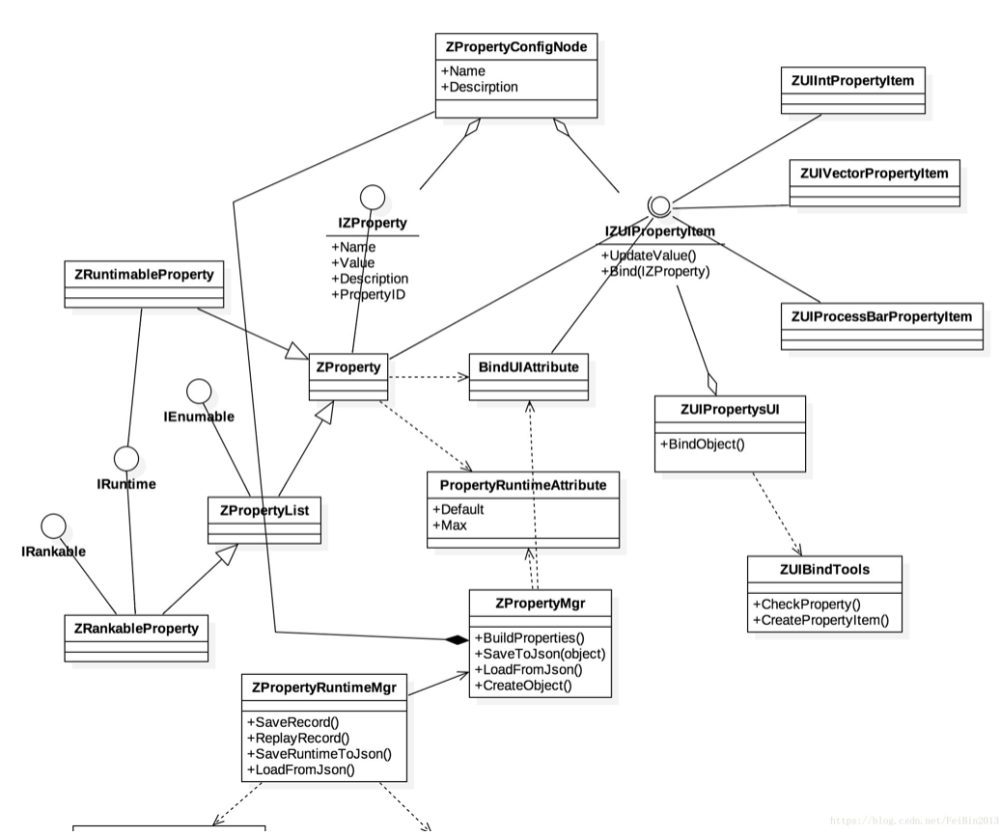
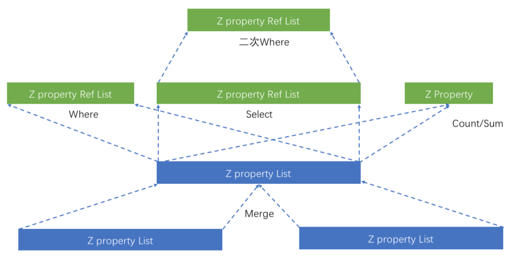
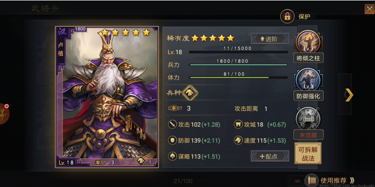
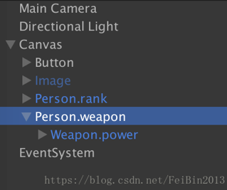
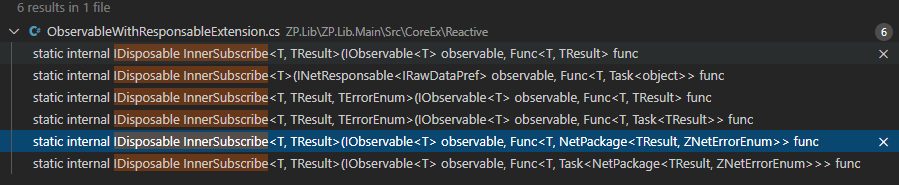
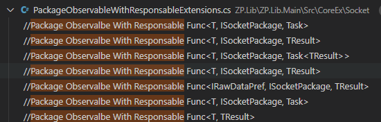
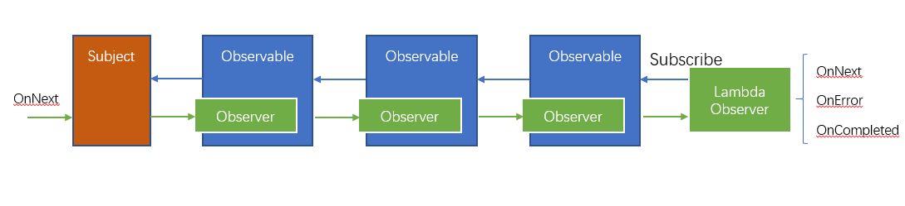
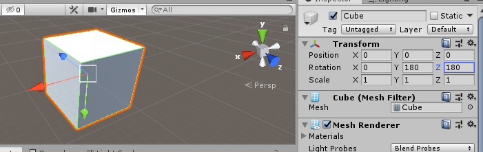

# ZP.Lib.Main
是ZProRx.Lib 框架的核心基础类库，提供包括：ZP的基础设施（构建、访问、池化、持久化、关系）基于ZP的反映式框架、网络框架、后端框架、Unity可视化分离架构等。

## 目录结构
- [Class类图](#class-%e7%b1%bb%e5%9b%be)
- [基本组成](#base-%e5%9f%ba%e6%9c%ac%e7%bb%93%e6%9e%84)
- [属性关联](#link-%e5%b1%9e%e6%80%a7%e5%85%b3%e7%b3%bb)
- [UI绑定](#ui%e7%bb%91%e5%ae%9a)
- [网络](#net-%e7%bd%91%e7%bb%9c)
- [Reactive & UniRx Extensions](#reactive--unirx-extensions)
- [Numerics & Math](#numerics--math)
- [使用配置](#config-zplibmain)

## 模块划分
- Core
  - Main(Properties) 主要包括属性类
  - Values 属性值类
  - Relation 属性间的关联
  - Pool 属性对象的管理、包括：单体、对象池等
  - Access 对属性的访问、存储。
  
- CoreEx
  - Net 基础网络、Http访问相关定义
  - Socket TCP UDP功能
  - Reactive 反应式操作、Ling操作
  - Status 基于属性的状态机
  - Grid(ZGrid) 基于ZP的网格结构
  - Tools 其它相关工具类
  
- Server
  - Engine Server后端引擎的实现
  - Physics Server后端物理引擎的实现
  - SQL 封装数据库操作
  - Tools Server后端相关工具定义
  - Asset 资产管理，包括、场景、预制、Json、目录等。
  
- Unity
  - RT(RTComponents) GameObject绑定类。
  - UI(UIItems) UI控件类
  - UIViewCore  UI核心类，主要用于绑定
  - Bolt 基于ZP的Bolt插件的扩展
  
- Editor

## Class 类图



## Base 基本结构
基本由属性和值 组成
值类可以是任意的类型，包括：Value类型（int、float）、Class、结构体、Interface等，ZProRx提供了一些预制好的值类。
如果一类中包括了ZP属性的定义，那么我们把这种类称为`IsPropertable`，我们后续简称为ZP类。
这种类也是开发ZP应用的主要载体。可以通过`ZPropertyMesh.IsPropertable`方法判断一个Type或者Object是否为`IsPropertable`。

基本属性类：
- ZProperty 属性类的基本定义，通过模板参数指定值类型
- ZPropertyInterfaceRef 用于定义引用属性，一般其值类型定义为一个接口
- ZPropertyList 用于定义一个属性数组
- ZPropertyRefList 用于定义一个引用属性数组

综合属性类：
- ZRankableProperty 用于定义分级的属性值，支持升级操作
- ZRuntimableProperty 用于定义实时属性值，支持记录、回放等功能
- ZTaskProperty 用于定义任务属性
- ZTimerProperty 用于定义定时器属性

以上各属性类都实现了`IZProperty/IZProperty<TValue>`

事件类
- ZEvent
- ZDirectEvent

事件也是一种属性，其实现了`IZEvent/IZEvent<TValue>`


主要值类：（预制值类）
以下说明包括主要值类
- 

### 创建与释放
ZProRx 通过如下方法创建ZP类的对象。
```csharp
var person = ZPropertyMesh.CreateObject<Person>();
person.blood.Value = 100;
person.rank.Value = 2;
```
`ZPropertyMesh.CreateObjectWithParam`可以传入构建参数。

通过
`ZPropertyMesh.ReleaseObject`释放ZP对象。

### Attribute 修饰 
属性在使用时会带一些附加信息，描述信息也有一定的层次的，包括：名称、简介、详细描述、图片介绍、链接、资源、UI绑定方式等多种形式。即属性又由其子属性组成。属性的附加信息，可以通过Attribute类【标签】来加以定义。

如下`PropertyDescriptionAttribute`的定义
```csharp
/// <summary>
/// Property description attribute, the item is the localization item's ID.
/// </summary>
[AttributeUsage(AttributeTargets.Field | AttributeTargets.Property, Inherited = true)]
public class PropertyDescriptionAttribute : Attribute {
    public string description;
    public PropertyDescriptionAttribute(string description)
    {
        this.description = description;
    }
}
```
使用方法如下：
```csharp
    [PropertyDescription("blood", "bloodDes")]
    public ZProperty<int> blood = new ZProperty<int>();
```

通过定义可以看出这些Attribute信息保存在属性类(ZProperty)的定义结构体中，即每一个类只需要一份Attribute信息。每个属性不能不同的类实例都自己保存一份，那样开销很大的。

以下面Attribute为例，支持两种配置名称与描述等修饰方法，第一个是通过Attribute属性，第二个是通过持久化文件 （即JSON），当然后者也需要Attribute属性进行配置，后面的属性Attribute会一一列举出来。

#### Attribute 的应用场景
Attribute可以定义在三种场景
1. 成员Attribute，即声明属性成员时定义的Attribute
   如：
    ```csharp
    [PropertyDescription("blood", "bloodDes")]
    public ZProperty<int> blood = new ZProperty<int>();
    ```
2. 属性Attribute，即定义属性类的Attribute
   如：`ZMsgList`其本身是一个ZProperty类，定义了一个`PropertyAddComponentClass`，用于在进行Unity的UI/RT 绑定时，调用AddComponent自动绑定到对应的GameObject上。
    ```csharp
    [PropertyAddComponentClass(typeof(ZUIPropertyListItem))]
    public class ZMsgList : ZPropertyRefList<IZMsg>
    {
        //...
    }
    ```
3. 值 Attribute， 定义属性Value类的Attribute
   如：以下ZMsg是一个Value类，定义了一个绑定的UIItem
    ```csharp
    [PropertyUIItemResClass("Msgs/Msg")]
    //for hint msg UI
    public class ZMsg : IZMsg, IIndexable
    ```

这里需要注意的是对于`ZPropertyRefList` `ZPropertyList` 这类的ListLike属性，成员Attribute和值 Attribute是对 List的Item生效的。但属性Attribute 即List的Attribute是不对Item生效的。
这里的例子就是`ZMsgList` 和`ZHintList` 属性类。

#### Attribute 优化级
以上定义的Attribute 的场景，如果出现冲突，对于一些互斥的Attribute，即只能获取一个。
这时按如下优化顺序返回
1. 成员Attribute，即声明属性成员时定义的Attribute
2. 属性Attribute，即定义属性类的Attribute
3. 值 Attribute， 定义属性Value类的Attribute

注：根据C#语法特性，分为：互斥的Attribute和支持重复定义的Attribute

#### 常用的Attribute
[PropertyLinkSync]
用于与修饰[PropertyLink] 配合使用，即如果设置后，Link宿主属性发生变化时，当前属性也能接收到消息并进行自动同步。

### Access & Query
通过如下API用于对属性访问
`ZPropertyMesh.GetProperty`、`ZPropertyMesh.GetProperties`
- 支持“Class.Property” 命名进行查询属性。

`ZPropertyMesh.GetPropertyEx`
- 支持“.XXX” 查询子属性，用于查询通用的子属性，比如：从同一基类进行派生后，其主类名已经不同，这时
- 支持多层查询，如“.XXX.XXX”
- 支持模糊查询，如”.*.XXX“，即当前节点的所有子节点的XXX属性。

`ZPropertyMesh.GetPropertyInSubs`
- 支持所有Child的查询

详细的使用方法，可以参考
ZP.Lib.Server.Test 工程，`TestAssessQuery`测试用例

后续将支持正则表达式进行查询

### 单体
ZProRx 架构提供了一些常用的单体模式，方便ZP类的使用
```csharp
public class ZPlayer : PropObjectSingleton<ZPlayer>
{
}
```
之后直接使用`ZPlayer.Instance`进行访问，其会自动调用CreateObject创建ZP对象。

### 生命周期
OnCreate
OnLoad
OnPreBind 在UI进行绑定之前进行调用，可以用于一些UI GameObject/Transform 相关的初始化操作。
OnBind 与UI进行绑定
OnPreUnBind 在UI进行解绑定之前进行调用，可以用于一些UI GameObject/Transform 相关的释放操作。
OnUnbind 与UI解除绑定，这时，对于通过[PropertyUIItemRes]属性进行创建的GameObject，还会保留下来。如果需要释放，需要自行进行处理，比如通过`OnPreUnBind`方法中，进行`GameObject.Destroy`。
OnCopy
OnDestroy

### 属性的持久化支持
正常的持久化，一般常常使用[Serializable]标签进行说明。如果使用这种方法的话，对JSON的支持是个问题。即需要有一些多于的信息被持久化，或者JSON的中属性也使用List的方法，但这样就不是很直观了，当然可以通过Editor扩展工具进行配置。ZP框架内部使用的是LitJson，它支持通过JsonData（类似字典结构）持久化为JSON一步步串行的进行持久化工作，中间加入这一层进行转换。
LitJson的官方地址如下，
https://litjson.net

持久化方法如下：
```csharp
var person = ZPropertyMesh.CreateObject<Person>();
ZPropertyPrefs.Load(person, "../../../Assets/TestPerson.json");
ZPropertyPrefs.Save(person, "../../../Assets/TestPersonCopy.json");
```
类似的还有：
`ZPropertyPrefs.LoadFromStr/LoadFromRes/LoadFrameRawData`

-----------------------------------------------------

## Link 属性关系
可以定义属性与属性间的关联，方便基于属性框架的开发。主要的关联关系包括：聚合、关联、视图

### 接口与聚合
即通过一个属性引用另一个类的对象。
ZP内容类支持 接口(`interface`)做为值（Value），如下所示
多用于引用一个对象，即可以理解为对象间的关联。（UML中的聚合或者组合的关系）

```csharp
  public ZProperty<int> CardID = new ZProperty<int>();
  public ZProperty<ICard> CardProp = new ZProperty<ICard>();
```
如上面的例子，通过ICard接口，可以指定不同的派生值类，通过CardId进行标识要引用的对象。

还可以以另一种方式比较对象间的聚合关联关系，即使用`ZPropertyInterfaceRef` 接口引用
ZProRx为了简化上面的使用方式，引入`ZPropertyInterfaceRef`属性类，通过其成员`RefID`,标识引用的对象，即实现ICard接口的实例。

```csharp
  public ZPropertyInterfaceRef<ICard> CardRef = new ZPropertyInterfaceRef<ICard>(OnLink);
```
其中构造参数是用于定义关联的方法，其会返回，聚合的对象。
类似的还有`ZPropertyRefList`属性类，用于定义引用对列。

总结：可以看到两种方式，前者需要通过ID手动进行聚合。


### View 视图
类似Mysql视图的概念
视图是对若干张基本表的引用，一张虚表，查询语句执行的结果，不存储具体的数据（基本表数据发生了改变，视图也会跟着改变）；可以跟基本表一样，进行增删改查操作(ps:增删改操作有条件限制)；
从面向中数据开发的角度出发，视图就是数据源的进行不同层次的映射、汇总、抽象，每一层次为不同业务进行服务，方便逻辑处理，提升开发效率。对视图、数据的设计很重要，它是上层设计的基石。基础打不好，后面早晚会出现问题。也可以把其理解为观察者模式。

ZProperty框架引入Select/Where/Merge/Count/Sum等方法，对源数据进行处理，生成不同的视图。它与Linq很想，用过的一定会很喜欢Linq的强大，其实作用是一样的，其核心还是面向数据的。不过LINQ生成的还不能叫视图，因为如果源变化时，视图不会进行更新，这是因为Linq是基础框架，面向的List这些基础类，但在ZProperty的基础上，我们就能做的真正的视图，视图会根据源进行动态变更。其实原理很简单就是注册相应的事件。



主要视图方法如下：
- Select：对数据源进行变换，数据量是一致的，数据内容进行变换

- Where:  对数据源进行有条件的映射，数据量会变为满足条件的数据量，数据内容不变。

- Merge：对多个数据源进行合并。数据量是总和，数据内容保持不变。

- Count: 数据源的数量，映射到一个变量中。

- Sum：数据源（ZPropertyList/ZPropertyRefList）的各项和，可以根据条件对项目进行选择，同时也支持对求和的方式进行配置。 目前Sum视图只支持`uint/int/float/double`类型的Sum视图

- Cache: 用于缓存，即到达一定的数量之后，进行删除，不会主动删除元素，即只会监听数据源的Add操作。
- Sort：排序、当数据源Add/Del操作时，会进行重新的排序

注意：以上Select/Sum/Cache/Sort等，只有`ZPropertyRefList` 才能做为视图，因为表达的是引用的关系。而`ZPropertyRefList` 和`ZPropertyList` 都可以做为数据源。
，如果`ZPropertyList`做为数据源，其T值 一定是可以索引的，即实现了 `IIndexable`接口的对象，否则会创建视图失败
每一个视图方法调用后，会返回一个IDisposable，可以调用其对关联进行取消，解除与属性的视图关联。


### 关联
有关关联的定义的，可以参考
视图之后，引入另一个概念“关联”，也就是把两个Property（数据）进行关联。
视图也是一种特殊的关联。
其实各数据、普通的Property组成的只是一个树形/森林的结构，
正常的Property框架，一个对象可以向下访问其结构中的Property。
而我们希望的Property组合成了一个大的 Mesh，需要具有横向、向上或者任意的联结，以保证逻辑需要。
比如一子弹打中物体后，需要知道其发射者的信息，完成记录功能。

注意与视图的区别：
- 视图也是单向的关联。
- Select只是观察者，是单向的，而Link有双向的同步功能。
- Link同步可支持进行设置，同时内部也是实现的是Select

注意问题：
目前Link的时机还是比较早的。会被接口隔断。除非是接收其对应的OnValueChange

视图与关联，是否需要考虑可见性的问题。

### 链式关联
[2019-12-08][TODO]
目前视图与关联还都是不支持链式的，即需要属性主动进行关联，后续将支持被动式的链式操作，
比如：

```csharp
ZProperty count.Link(otherPro.beWhere(node => node.value > 1).beCount());
```

链式方法使用Be关键字前缀

## UI绑定
目前只支持与Untiy的元素的绑定。

### 绑定 Unity Bind
把属性与Unity元素进行Bind
这部分提供了如何与UI能进行自动化的绑定，动态更新等机制，同时对一些常用框架的支持，比如上接UGUI、下连UniRX、ZECS等。同时也支持创建动态UIItem，比如对一些列表的支持等。当然这里的可视化绑定也适用于3D表现。
需求实例（以下面率土为例，列举常用UI Item）



可以分解出如下类型的属性，以及对应的UI表现。
等级/稀有度：int/byte类型，使用小星星作为表现
血条/兰条：float类型，进度条表现，也会有数值显示，参考包括最大值、颜色。其实就是做为不同的Prefab但是UI类是一个。
数值属性：比如攻击力防御值等属性。会显示附加值即“（）”里的内容。类型的附加值，如果固定可通过Attribute的方式进行定义，当然也可以使用下面介绍的复合类型。
ICON：类型左侧卡片上的攻击距离的表现，由一个图标和数值组成。
复合类型：即左侧卡片做为一个整体属性，其本身又由子属性组成。如下代码所示，武器类包括子属性。

```csharp
	public class Weapon {
		[PropertyDescription("power", "a power data")]
		public ZProperty<float> power = new ZProperty<float>();
	} 
	public class Person {
		public string TestID;

		[PropertyDescription("等级", "玩家的等级信息")]
		public ZProperty<int> rank = new ZProperty<int>();

		[PropertyDescription("血量", "玩家的名字")]
		[PropertyUIItemRes("Test/Image")]
		public ZProperty<int> blood = new ZProperty<int>();

		[PropertyDescription("weapon007", "a power weapon")]
		public ZProperty<Weapon> weapon = new ZProperty<Weapon>();
	}

```



由于Server端无法解析Unity的Scene和Prefab等资源文件，所以使用的json进行定义。

可以通过自动化进行UnityScene等资源文件的转化。

#### Unity 支持

`GameObject.Find("Monster/Arm/Hand")`

MonoBehaviour 的以下行为支持，目前只支持前三个
```csharp
Awake()
Start()
Update()
FixedUpdate()
LateUpdate()
OnGUI()
OnDisable()
OnEnable()
OnDestroy()
```

#### Event 绑定
目前只支持与Button进行绑定。
[TODO]对于3D View需要支持可点击的3D对象（控件）,需要支持`RTClickable`脚本的动态绑定。
`RTClickable`如果想要生效，需要依赖EventSystem和Physics RayCaster组件绑定Camera上。
详细的应用参考[EventSystem应用于3D GameObject](https://blog.csdn.net/FeiBin2013/article/details/80262119)

对于Unity Event的绑定，大概分两种情况，一种是UGUI相关，由ZViewBuildTools 进行绑定，比如 Button，通过
```csharp
    btn.onClick.AddListener(()=> { 
        prop.Invoke(); 
    });
```
其是通过对`UnityEvent`的操作。
[TODO] [2020-01-16] 这里的Event的 解绑还未进行对应。

一种对于GameObject的三维相关事件，比如 基于EventTrigger的单击事件等。这里未来还需要对加回 UniRX.Trigger的支持。

#### 控件
定义基本的一些预制件如下：
[TODO] 
- ZUIInputPropertyItem: 支持Placeholder,

支持以下共通的预留的子结点名
```csharp
public static class ZViewCommonObject{
    public static string Name = "Name";
    public static string Description = "Description";
    public static string Data = "Data";
    public static string Icon = "Icon";
    //public static string Count = "Count";
    public static string Bar = "Bar";
    public static string Root = "Root";
    public static string Items = "Items";
    public static string Model = "Model";
    public static string Minute = "Minute";
    public static string Second = "Second";
}
```
#### UI 属性 绑定
[v1.1][TODO]
类似VUE。比如 Active 显示。即定义对应的属性，通过Attribute 修饰，定义其绑定的UI属性或者行为。
类似 `ZProperty.ActiveNode` 方法的功能。

----------------------------------------------------------


## Net 网络
包括Socket 和Http的支持。

### Socket Support
包使用的共通的NetPackage包结构，其模板使用可以用于扩展支持自定义的数据。
使用Topic进行消息的发送与订阅，分为客户端与Server端两种情况。
客户端订阅一个消息时，是否加上ClientId为Topic的一部分
从Socket层来说，其ClientId是透明的。需要应用进行封装与控制。

接口格式如下：
Post[Package] 用于异步发送，支持错误返回，即发送失败。比如网络异常等。其返回值不表示接收者已经接收。
Send[Package] 用于同步发送，并接收返回值。
Receive[Package/RawPackage(SocketPackageHub)/LowSocketPackage][AndResponse]

- RawString 发送普通字符串
- Package 是ZP格式的数据包，格式如下，如果其支持Response时，内部是使用串行返回的。
- AndResponse 表示接收到之后可以进行返回。返回值支持`ZNull`，其不会占用传输的Size，但其表达接收到返回值，常常用于回应。
```csharp
    public class NetPackage<T, TErrorEnum> // where TErrorEnum : System.Enum
    {
        private ZProperty<T> data = new ZProperty<T>();
        private ZProperty<TErrorEnum> status = new ZProperty<TErrorEnum>();
        private ZProperty<string> msg = new ZProperty<string>();

        private Dictionary<string, string> headers = new Dictionary<string, string>();
    }
```
- RawPackage 即(SocketPackage)，是指带有ClientID的Package包。如果其支持Response，那么内部是使用的并行返回的。
- RawPackageAndResponse 接收端可以获取到`SocketPackageHub` 其包括`ISocketPackage` 原始数据包，和封装的NetPackage包，可以获取额外的客户端内容。比如ClientId等。
```csharp
    public interface ISocketPackage
    {
        string Key { get; }
        string Value { get; set; }
        string Topic { get; }
    }
```
- LowSocketPackage 以接口的返回 `ISocketPackage`包，用户可以根据需求自己进行Package的解析，当然与需要发送端协商一致。
  这里要注意与上面的RawPackage 和 RawPackageAndResponse 返回的是不同的，即返回的直接的 `ISocketPackage`包，需要自行进行数据包的解析。

SocketObservable
Socket[RawRequest/Request/Package/RawPackage(SocketPackage)]Observable
- Request 用于通用的请求
- Package 用于Receive请求

返回IObservable 
支持取消功能，调用Dispose方法会进行反注册等取消操作。
对于调用

#### T 参数
对于带Package的API，都对应对应的几套模板，
基本包括：
- `无`
其中无参数的即以`IRawDataRef`去接收数值，应用根据 GetData<T>方法获取到对应的数据。

```csharp
    (IRawDataPref rawData, ISocketPackage rawPack) => {
        Assert.IsTrue(string.Compare(rawPack.Key, "1000") == 0);

        //throw new Exception(""); 
        //throw new ZNetMultiException<TestErrorEnum>(TestErrorEnum.Error1);

        //get data from IRawDataRef
        var data = rawData.GetData<TestPropData>();
        Assert.IsTrue(string.Compare(data.name.Value, "testobjectname") == 0);

        //return result
        return true;
    });
```
- <T> 目前未支持实现，所对应的功能 [TODO]
- <T, TResult>
- <T, TError,TResult>

以上不同的层次，可以进一步明确接收参数、回应返回值参数、回应可能出现的错误
<T, TResult> 时 对应可能的错误值为 ZNetErrorEnum

<T, TError,TResult> 时，错误值为自定义参数类型，通过[MultiEnum] 方法对ZNetErrorEnum进行兼容。

**注意**
对于无参数的方式，其优点是有很强的通用性，但是以牺牲是一定的性能（需要转换多次）以及可读性。
对于明确返回值类型以及错误类型的还是推荐使用对应的模板参数。

SendPackage的API要简化许多，这里只有<T, TResult>  和<T, TError,TResult>两个版本。
对于没有明确返回错误模板参数的，在处理中返回自定义错误也是可以的，这时要使用 `SendPackage2<T, TResult>` 进行接收返回值，其可以接收所有异常，其异常类型为ZNetException<string>。
`SendPackage<T, TResult>`其只能接收并抛出 ZNetErrorEnum 异常值，如果Server端返回其它异常，Server端会直接抛出，而Client端无法接收到返回值了。
当然`SendPackage2<T, TResult>`也同样是有一定的性能损耗。

推荐使用ZException进行统一接收以及Rx的Catch操作。以下是Ignore一个异常。
```csharp
    .CatchIgnore((ZException ex) =>
    {
        Assert.IsTrue(ex.IsMultiError<TestErrorEnum>(TestErrorEnum.Error1));
        Assert.IsTrue(true);

        taskEnd.Value = true;
    })    
```
以下是Catch一个异常并返回新的数据流。其实是新建立了一个分支。
```csharp
    .Catch<bool, ZException>((e) => {
        return Observable.Return(true);
    })
```

#### 安全
在TTPServer端 ValidatingMqttClients的方法中进行相关的安全Token验证。Token来至ZRoom的Token
（在调用 JoinRoom API返回）
/api/v1/matrix/arch/users/{vroomid}
[TODO] 目前未对应

#### Retry支持
Rx规范对应，Net API Retry的支持，要支持Retry，其内部原理是实现进行重新订阅，需要支持Retry的Observable的实际动作应该在SubscribeCore 方法中完成。

Receive API 不支持Retry

#### Reactive 

以下都是ZRropertySocket.Socket/Net
Receive[Package/RawPackage(SocketPackage)/IRawPackage][AndResponse]


如下所示：对于Receive Package 支持的反映式的处理方法。



主要的订阅包括：
```csharp
IObservable<T>

INetResponsable<TResult>
INetResponsable<TResult, TError>
INetResponsable<IRawDataPref>
```

RawPackage 的支持



 包括的订阅：
```csharp
IObservable<SocketPackageHub<T>>

IRawPackageObservable<IRawDataPref>
IRawPackageObservable<T, TError>
IRawPackageObservable<T>
```
其中SocketPackageHub 还未支持 自定义的错误类型 Enum

#### Dispose
- 对于Receive操作一般要保持长时间的Active状态，所以一般是Channel/Room/APP退出时进行调用，可以与对应的Extension进行关联
- 对于Send/Post 操作，一般是短时间进行，可以不进行Dispose。但对于些有返回值的Send操作，需要可以进行Dispose操作。其实内部在接收返回值时，会定义一个Result的临时的Topic进行接收。这个是会自动在接收到消息之后进行反注册的。但推荐还是进行Dispose操作，使用using。

### Web Request Support
 - 对于Recevie + [AndResponse]的接收API, 其返回值类型还支持错误值处理，即通过Server端返回错误值，目前支持`ZNetErrorEnum`通用Enum类型，同时支持自定义的Enum类型。这里使用的复合Enum类实现，`MultiEnum<ZNetErrorEnum, TErrorEnum>`
  如果Recevie 端（Server）需要返回给错误信息给调用者，通过Throw `ZNetException`类的异常。
  
如下参考的错误定义，Base从`ZNetErrorEnum.MaxError`开始定义。
```csharp
public enum RoomErrorEnum 
{
    BaseError = ZNetErrorEnum.MaxError + 0x100,
    UnsupportedUnit,
    NotFindUnit,
    NotFindRoom,
    NotInService,
}
```
主要用法是

[TODO] 错误码要与HTTP 标准码进行关联，目前还未设计 

**注意事项**

对网络等返回Observable的API是不支持Await的，因为接收到个消息后，不会触发Completed事件。
如:
`ZPropertyNet.Post/Get/Put`

如果一定直接使用它们，并需要进行Await的话，需要调用Fetch操作。
对于整体ZPropertySocket 的API也都是同样的问题。
类似的还有一些带有连续的消息，也都只有Completed时才能Await返回。

-----------------------------------------------

## Reactive & UniRx Extensions

### Observer 扩展
- [TBD] 支持Map的Observer的值转换，类似Observable的Select

### Operators 操作符
- Fetch 即每一个OnNext后都会新开一个分支，并进行一次处理后就完成。一般用于网络消息处理。这样才是可以Await的

### MultiObserver
对应以下Observable链的性能 问题



避免多次进行Subscribe。一次Subscribe的开销是很大的。
每一次Register都会触发整个Observable链的连锁反应，包括，注册过程以及Observer的构建过程。即一次Subscribe就会产生一长链的Observers。如果要多次处理操作时，应该使用的Do操作符，但每加一个Do就是加长了一个链上的结点，Observable链就长了一节。

可以使用以上`MultiObserver`结合`Observer.Create`把Observer也组合起来。
这里后续可以有很多的变化，比如轮询分发给不同的Observer等。

### ToCancellable
使用的`ToCancellable` 方法，进行返一个可以取消的`Observer`，其可以获取到一个`CancellationToken`，用于Task等资源的取消。
支持CancellationTokenSource从外部传入。

### LinkedSubscribe
可以连接多次订阅处理，这个功能与UniRx的Do 操作相同，但它不需要Do后再进行订阅操作，是Do和Subscribe的合体。

-------------------------------------------------------

## Numerics & Math
有关Server端使用UnityEngine中三维计算库方法的问题，一些基本的Vector、Rect、Bound、Mathf等三角函数还是可以用的。但也有例外，比如，Matrix4x4.TRS这样去创建一个Matrix4x4是不可以的。翻了下Unity源码，它也是调用的外部方法，在Github上的源码没有找到。
其中类`ZTransformEx`就是用于封装，当前UnityEngine中无法在Server端使用的方法。对外接口参数一致以Unity类型为准。内部使用`System.Numerics`进行实现以及转换。
有关内容可以参考
https://blog.csdn.net/FeiBin2013/article/details/86574687


### 三角函数
Euler角的问题，由于UnityEngine.dll一些相关的三角函数在Server端无法使用的，使用的是System.Numerics进行变换。
就从 Quaternion 到Euler的转换上返回值有一定的不确定性，比如Server端返回值为 (0, 180, 180)
```csharp
euler = Quat2Euler.QuaternionToEuler(new Quaternion(1.0f, 0.0f, 0.0f, 0.0f));
```
而Unity的设置值为(180, 0, 0)



但其方向值是一致的。
所以要避免有Euler角或者Quaternion的直接比较，应该使用的向量的进行比较。


## 线程安全
对于ZPropertyList等类的线程安全需要自行考虑。
ZP框架中基于其的应用，比如`ZUIPropertyListItem` 已经加了锁，来保证线程安全。

------------------------------------------

## Config ZP.Lib.Main

- 通过Nuget下载 
  .Net CLI
  `>dotnet add package ZP.Lib.Server --version 1.0.3`
- 通过Githup上源码编译
- Unity通过Asset Store（未上线）

### 工程设置

### Unity 端环境配置
1. 

### 目录说明
	Core可以移植到NetCore环境中。需要UnityEngine.CoreModule.dll支持
	CoreEx也可移植到NetCore环境中，但需要UniRX的支持。
	Client为Unity中使用的内容。

### $\color{red}{工程宏定义}$

	#define ZP_UNIRX    //Support UniRx
	#define ZP_BOLT     //Support Bolt
	#define ZP_UNITY_CLIENT //Unity Client
	#define ZP_UNITY_SERVER //Unity Server 用于使用Unity 客户端对Server进行模拟测试。

	#define ZP_SERVER // Server 用于使用.NetCore端对Server

	#define ZP_M2MQTT // MQTT Client support
	#define ZP_MQTTNET // for MQTT Server


[返回ZP.Lib](../Readme.md)
