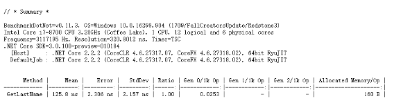

# ZP.Lib.Server.Test

## 目前问题
1. [Fixed]需要支持Socket的端口测试。
2. [Fixed]对于TTPServer的验证确认。
3. [TODO]基于Benchmark .NET 进行基准测试 详细参考：https://mp.weixin.qq.com/s/ZUQ1yFQwgYDDFsEWZIo5Qw
   https://www.stevejgordon.co.uk/writing-high-performance-csharp-and-dotnet-code

   

4. GetComponentsInParent 还没有进行测试。这个可以跟场景自动生成插件来进行测试。