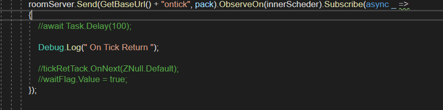

# DevLog for ZP.Lib.Soc

## 后续功能
1. 支持Attribute可以设置Channel的Msg处理为串行的，可以用于一些互斥的情况。
2. Channel信息中包括返回配置信息。

### [v1.0.10] 计划版本
1. Bug list 16+

## Bug （TODO）
1. [v1.2]BroadCast需要支持，发送者不再接收的功能
2. [v1.1]现在还不支持多ChannelBoot 属性设置与获取。
3. RoundChannel中的CurRound不对，不是回合数
4. [Fixed]Round 和 SyncFrame Channel中的Start和Stop还未进行对应。应该是从Server进行一个开启或者关闭的方法。[S]
5. [v1.0]目前各Client的Channel一定一致，不然会出错，因为只有第一个Client联结时，才会对Channel进行更新。
6. LoadSceneSync 方法，还是又返回Observable，又在内部进行订阅 Subscribe
7. [Defer][v1.1]GetActions 还有很多的没有进行对应
8. Channel以及Room的接口，对应的Post与Send的封装还有很多的问题，可能要一起进行重定义。
   
9.  [Fixed]ZNull 需要参考 Unit 进行补充，比如比较等方法
    
10. [Defer][v1.2]PipelineDefaultServerChannelTypeAttribute 这个属性还未有效，需要考虑跨Dll的方案。
11. [Fixed]线程安全确认 【2020-02-18】
    -  SocBuilding 的 IsInService
    -  SocBuilding 的 ClientList

12. [Fixed]return null Check
 - TTPClient 的 IObservable<string> SendMsg

13. [Fixed] LocalChannelClient 确认是否还有用，不再使用
14. [Defer][v1.1]round 的 roundcast 未进行支持
    
15. [Fixed] DuduBattleChannel 中也有agents这个是不需要的。
16. 统一排查，Subscribe 内外同时订阅的情况，比如 ` public IObservable<ZNull> LoadSceneSync(string sceneName)`,会触发两次的处理。
17. BasePipeline 中的ZChannel类的成员 多余与国基类中的重复。

18. Round 的一些功能还未完成，比如Suspend Stop等操作。
    RoundChannel的Thread Stop后，未进行等待，需要进行确认。（Unit Test）

19. Round 在进行过程中，Disconnect会出现问题。

20. BroadCast 在ZProRx.Matrix 的Demo中第一次连接时，本地是可以接收到自己的广播的，重新连接后，本地就收不到了。

21. 支持返回IObservable 的方法参考使用统一命名规则

-------------------------------------------------------------------------

## Debug Journal
1. [Fixed][TODO] 目前 发现一个Task Thread的问题，如果使用以下的方式，接收Subject或者ReactiveValue并调用Await的方法进行等待时，会出现等待后重新跳至Tick函数开头重
新运行，所以会出现Task异常结束。

WorkAround对策：使用的轮训的方式进行判断。
【结论】使用STD2.0更新了UniRx的Server端使用的Lib，直接使用它的Await（GetAwaiter）就没有这个问题了，应该还是Completed事件的问题。

2. [Checklist]Observable.Create 这个东西，比较坑啊，其CreateFunc是在Subscribe时才调用的，默认的使用的Subscribe的Scheduler。
[TODO] 这个需要进行一步确认，是否可以通过参数对应这个问题。
以上这个问题的一个主要表现就是`SendPackage`，可能会依赖，订阅的环境。

## TestCase
1. [Done]普通连接，连接后，还需要能再次连接。
2. [Done]房间支持多次的连接。
3. 同时支持多个房间的多次连接

---