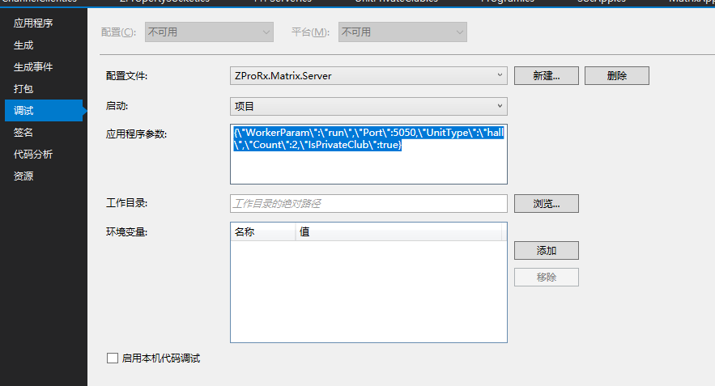

# ZP.Lib.Soc

0. 概要
Socket Server端应用框架
参考NetCore IOC框架，支持依赖注入
Channel类型Web Controller

IOC代码参考NetCore的源码
https://github.com/aspnet/MetaPackages

通过Console启动的版本，可以通过按任意按键进行退出。方便用于Debug。

### 主要概念目录
 - [房间 Room](#%e6%88%bf%e9%97%b4room)
 - [通道 Channel](#%e9%80%9a%e9%81%93-channel)
 - [本地通道](#本地通道)
 - [套间](#RoomSuit)

主要管道参考：
- [广播系管道](#BroadCastSeriesPipeline)
- [回合管道](#回合管道)
- [帧同步管道](#帧同步管道)
- [场景管理管道](#场景管理管道)


## 房间（Room）

1. Room Topic [Server]
主要话题定义如下：

```s
    matrix/hall/connect/{vroomid}           //param: SocConnectResponse with channel list //return: ZRoom 
    matrix/hall/reconnect/{vroomid}         //param: SocConnectResponse with channel list //return: ZRoom
    matrix/hall/disconnect/{vroomid}        //param: znull //return: Znull
    matrix/hall/{vroomid}/heartbeat
    matrix/hall/{vroomid}/getchannels
    matrix/hall/{vroomid}/getinfo
    matrix/hall/{vroomid}/arrived/{clientid}
```

2. 安全性
通过Token的方式进行验证。
Token中包括RoomID，ClientIDs以及创建时间，当前状态等。
Token可以集成在SocketResponse的头中。

Room的Connect方法需要进行验证，以及一些方法可以追加以下属性 
【SocAuthorizeAttribute】

目前Room的Connect方法 还未进行验证 TODO


3. 生命周期
用于整体Container监控其Room的使用率，如果空闲一定时间后，会自动关闭


## 通道 （Channel）

1. Chanel共通Topic [ClientAndServer]

```s
    matrix/hall/{vroomid}/{channel}/connect         //param: znull //return: Znull
    matrix/hall/{vroomid}/{channel}/disconnect      //param: znull //return: Znull
    matrix/hall/{vroomid}/{channel}/{action}        
    matrix/hall/{vroomid}/{channel}/getinfo
    matrix/hall/{vroomid}/{channel}/status          //param: ChannelStatus
    matrix/hall/{vroomid}/{channel}/getactions
```


Client 返回接口：IChannelClient 
Server 访问接口：IChannelClient 

$\color{red}{[ClientId的说明]}$

Client端ClientId标识自身
对于Client端的Channel Open时加上ClientId，其实其对应运行时所在TaskScheduler中的标识，（对于Unity Client端其可以从Socket类中的全局变量中获取）
Server商ClientId标识，连接它的各个Client。各Client的Channel在Listen时也会自动加上ClientId
注意：其以 上两者返回的同一接口的不同实现。

### 属性
定义位置：
- [FrameSync]

支持记录、回放功能
回放功能：比如，在新用户或者断线后，重新接入时，需要进行功能的回放

不正确的方向：一个Channel在一侧注册后，另一侧可以获取对应的Channel类，再调用相应的方法可以进行发送


- [AutoEnable]Channel有是否启用的状态，只能通过Channel Server端进行配置。默认是开启？
- [AutoOpen]
- [Broadcast]用于Server端，接收到后会分发给各Client
- [TLSSupport] 支持？？【TBD】
- [UdpSupport] 不能单独进行设置应该是全局的设置


- [ErrorDefines]
以这个值ZNetErrorEnum.MaxError，为基准进行自定义扩展定义

### 访问

通过IChannelClient接口获取到。
通过以下类可以返回，如果在Channel中，可以通过IOC获取到对应`IRoomClient`接口
如果为SocServer Channel中，对应的IOC接口为`IRoomServer`
   1. RoomServerBehaviour
   2. SocRoomClient
   3. SocRoomServer
   
### API
命名规则
- server send
send = url + [ClientId]
Recv = url + [ClientId] + /Result

- Client Recv
Recv = url + [ClientId]
Send(setResult) = url + [ClientId] + /Result

即传入的URL已经带有ClientId，不再需求追加ClientId了

- client call
send = url 
Recv = url + [ClientID] + /Result

- server Recv
recv = url
send(setResult) = url + [ClientID] + /Result

以上两种情况，URL未带有Client，需要在接收时带入CLientId

### Action
Channel可以使用函数的方式定义Action

```csharp
    [SyncResult]
    [Action("selectDard")] 
    protected void SelectDard(ISocketPackage response, [FromBody]int cardId)
    {
        var clientId = response.Key;
        Assert.IsNotEmpty(clientId, "client id is Error null");
        selectedDardMap[clientId] = cardId;
    }
```

#### Action 参数
- [FromPackage] 用于接收Post/Send 发送的Package包数据，类型与发送参数类型保持一致。
- `ISocketPackage` 可以用于获取Socket包的内容，比如ClientId
- Ioc参数：[TODO]后续将支持Ioc参数，即自动注入的参数。

对于[FromPackage]的参数，其支持ZP对象（ZP类）、ValueType（基本类型）、`IRawDataPref`类型。
最后者用于接收不定可变的参数类型，其本质即是没有进行解析的Json对象。可以根据Action，手动去解析对应的对象。
```csharp
    var cmd = ZPropertyMesh.CreateObject<CmdPackage<TCmd>>();
    ZPropertyPrefs.LoadFromRawData(cmd, rawData);
```

## 本地通道
 （Local Channel）

支持本地的Client与Room连接，比如对应一些AI的情况。
一个SocClient 应用中不支持多个类型的RoomClient，如果需要多个类型的就进行创建多个进程
但对于本地的RoomClient由于其Room只有一种类型，那么，其就只有一种RoomClient

详细参考
[ZP.Lib.SocClient](../ZP.Lib.SocClient/Readme.md)


## 管道
 （pipeline）
即双向Channel组成。pipeline实现了IChannelClient的接口。比如，MultiCast 管道就支持IGroupClient接口。
XxxxxPipeline目前只支持在Client端进行定义，其会自动创建对应的Server端Channel。也可以通过属性指定对应ChannelName。
默认会创建共通的Channel，比如：RoundPipeline和其派生类，会创建对应的RoundChannel，如果追加其的派生类SubRoundChannel。需要在定义PipeLine时通过属性指定对应的Channel类。目前是通过两端都使用的相同的名字进行定义。如果找不到同名的Channel，就会Throw 异常。
做为管道client端不需要接收Connect消息，其如Connect 到Server端会调用其Open方法。


### 主要管道：
广播、组播、单播。回合制、帧同步。
各Pipeline使用了[ChannelBootAttribute]中的一位来标识。

支持自定义Pipeline，需要指定[ChannelBootAttribute]为Pipeline
其需要指定两端的类型，并要求同名。即分分别以Pipeline(Client)和Channel（Server）定义。
其中Battle中的RuntimePipeline就是自定义类型的
详细参考：[ZP.Lib.battle](../ZP.Lib.Battle/Readme.md)

- 如何进行管道的访问
通过以下类可以返回，如果在Channel中，可以通过IOC获取到对应`IRoomClient`接口
如果为SocServer Channel中，对应的IOC接口为`IRoomServer`
   1. RoomServerBehaviour
   2. SocRoomClient
   3. SocRoomServer
可以通过获取GetChannel<>类型直接进行访问，这种访问方式，要求Channel或者Pipeline的定义在本地，如果是远端的访问，需要使用`IChannelClient`的获取。
或者通过`IChannelClient`接口获取到。（目前已经支持）[Fixed] [2019-12-17]

**注意**：这里需要注意ChannelClient和Channel的区别，对于管道来说，pipeline又是channel即是Client。

IChannelClient 简介：
```csharp

    public interface IChannelClient : IDisposable
    {
        IObservable<ZNull> Connect();

        IObservable<ZNull> Connect2();

        void Disconnect();

        IObservable<ZChannelInfo> GetInfo();

        ChannelStatusEnum Status { get; }

        List<string> GetActions();

        IObservable<TResult> Send<T, TResult>(string action, T data);

        IObservable<Unit> Post<T>(string action, T data);

    }
```
其中 `Connect2`会返回目前已经有Client，并调用OnConnected 消息，对于，不依赖这个消息的，可以使用的Connect进行轻量的连接。
所有管道都可以获取到ClientCount的个数。

参考：
- [广播系管道](#BroadCastSeriesPipeline)
- [回合管道](#回合管道)
- [帧同步管道](#帧同步管道)
- [场景管理管道](#场景管理管道)


### [代理]
对于帧同步与回合管道，支持通过Agent进行对应的消息接收。
【其只有Client端才有用，Server端每个Client都对应为一个实体PipeLine ，所以不支持也不需要代理。】这句话不正确，Server端也可以有代理。
与Client是一对一的关系。一个Agent相当于一个ClientID在每一个运行的环境中都有一份代理（包括Client与Soc、SocClient）
可以通过在Connect消息处理中，创建并加入ClientId对应的Agent。也可以通过属性指定，进行动态创建。
```csharp
OnConnectedObservable.Subscribe(c =>
{
    RegisterAgent(c, new TestClientAgent(c));
});
```

**主要属性**
- [AgentTypeAttribute]
可以通过这个属性，可以为pipeline指定Agent类，同时Agent在有Client接入时，会自动进行创建。
注意对于server端的Channel目前还不支持这个属性。

-----------------------------------

## RoomSuit
** (套间)**
 
有关Room 套间 的问题，
使用套间的进行Room的隔离，一个进程是支持多个Room同时运行的。
一个Room对应一个`TaskScheduler` （注意这里的C# System的Task 运行环境）。
这里要与BaseChannel的innerScheder区分开，后者是Reactive的Scheduler，即也依赖于TaskScheduler。

#### 调用套间的方法
BaseChannel提供了


#### **依赖套间的方法**
即以下方法，需要保证在相应的套间中运行，否则会出现异常 [TODO] 异常处理
- SocClient中的Net/Socket相关的Send/Post方法，由于在同进程内只是模拟调用的网络接口，其调用环境要要求在对应的套间，同时还得保证其
- Receive[Package/XXX] 是安全的
- 获取套间单体，即派生至类`PropObjectSingletonWithTaskScheduler (ZServerScene)` 和`PropBehaviourSingletonWithTaskScheduler (RoomMatrixBehaviour)`
- GameObject Instantiate

#### 套间的安全性
对于Server端调用Net/Socket相关的Send/Post方法等，其实也是要保证调用环境的问题，但是一般Client端不会接收RawPackage数据包的。

有关Observable.Create 带来的安全性
1. TTPServer.Instance.SendMsg 是安全的其在调用时先获取了当前线程Id
2. 

---------------------------------------------------------------------------

### BroadCastSeriesPipeline 
由于是广播，不再需要使用ClientID进行区分

- [BroadCast]
```csharp
    matrix/hall/{vroomid}/{channel}/_broadcast_/{action}			//Server
    matrix/hall/{vroomid}/{channel}/{action}			//Client
```

Client 访问接口: IChannelClient、IBroadCast

通过以下类可以返回，如果在Channel中，可以通过IOC获取到对应`IRoomClient`接口
如果为SocServer Channel中，对应的IOC接口为`IRoomServer`
   1. RoomServerBehaviour
   2. SocRoomClient
   3. SocRoomServer


- [MultiCast]

```s
    matrix/hall/{vroomid}/{channel}/joingroup       //param: groupId //return groupid
    matrix/hall/{vroomid}/{channel}/leavegroup      //param: groupId

    matrix/hall/{vroomid}/{channel}/_multicast_/{groudid}/{action}	//Server
    matrix/hall/{vroomid}/{channel}/{groudid}/{action}	//Server
```

Client 访问接口: IMultiCast/IChannelClient

**配置[GroupConfig]**
可以通过在Setting.json中追加以上配置，定义预制的Group组名。
Group可以通过Config配置文件 中追加字段进行定义。ChannelName + "GroupConfig"

```csharp
    public class GroupConfig
    {
        public List<string> Groups { get; set; }
    }
```

**注意**
组名一定要先进行指定，否则joingroup 命令会失败。

- [UniCast]
```s
    matrix/hall/{vroomid}/{channel}/call/{userid}       //param: userid //return 
    matrix/hall/{vroomid}/{channel}/_unicast_/{userid}/{action}
```
访问接口: IUniCast/IChannelClient


- [BroadCast]/[MultiCast]/[UniCast]
  
以上三种Channel，Server只是一个中介的作用，不需要通过Server端直接发送给对应的Channel信息。
如果需要可以通过派生各自的Server端Channel类来完成。
当然也可以获取到CLientId对应的IChannelClient接口，但不能实现广播、组播功能了。
各Client的Channel在Listen时也会自动加上ClientId（不然本地的Channel的Topic就无法进行区分了）

------------------------------

### 回合管道
[配置]
回合配置类定义如下：
```s
    public class RoundConfig
    {
        public int MaxRound { get; set; }		//最大回合数
        public int RoundHandTimeout { get; set; }       //ms，当前回合动作超时时间
        public int HandInterval { get; set; }       //ms    发起Hand后，Next动作的间隔
        public int RoundInterval { get; set; }       //ms   两个回合之间的间隔
    }
```

- [流程]
一个Rounc由每个Client各进行一个Tick之后，记为一个Round结束，进入下一个Round。
每Tick只有一个Client获得Hand（令牌），可以发布命令。之后需要调用`Hand（）`或者等到Timeout时间到。进入下一Tick。


[Topic]
```s
//from client to server
matrix/hall/{vroomid}/{channel}/round/start       //param:  //return 
matrix/hall/{vroomid}/{channel}/round/stop
```

以上两个是同步的，即都收到所有Client之后，才会返回

matrix/hall/{vroomid}/{channel}/round/hand
每一回合，以这个为结束标志，或者通过属性定义一个Action做为结束
通过Header ? 
```s
matrix/hall/{vroomid}/{channel}/round/enable       //param: clientId //return 
matrix/hall/{vroomid}/{channel}/round/disable	      //param: clientId //return 
matrix/hall/{vroomid}/{channel}/roundcast/#


//form server to client
matrix/hall/{vroomid}/{channel}/ontick
matrix/hall/{vroomid}/{channel}/ontick

matrix/hall/{vroomid}/{channel}/roundcmd/{clientId}      //param: CmdPackage<TCmd> //return 
```

------------------------------

### 帧同步管道 
[SyncFrame]
```s
//from server to client
matrix/hall/{vroomid}/{channel}/syncframeupdate       //param:FrameId and BattleFrameUpdateMsg ListUpdater with no header  //return: 
```


[SyncFrameUpdateAction]用于Client端，定义帧Update的方法。
[SyncFrameEnumAction]
matrix/hall/{vroomid}/{channel}/syncframe/{action}
matrix/hall/{vroomid}/{channel}/syncframe/action
用于从Client端推送Enum型的Action

//from server to client
matrix/hall/{vroomid}/{channel}/onclientConnected/{clientId}    //param clientId  //return :null
matrix/hall/{vroomid}/{channel}/onclientDisConnected/{clientId}  //param clientId //return : null

帧同步Channel
支持Action支持方法和Enum定义

帧同步中，可以通过syncframe Topic进行数据的更新，当然也可以通过EnumActoin接收后进行动作(Agent可以接收到并进行处理)。
这其实本质就是Server端计算还得Client计算的问题。
如果是Server端计算，Agent 就不需要进行动作了。这时可以用于一些玩家状态的变化。其实也是用于分离、数据层与表现层。
比如位置是由数据同步过来的，这时Agent可以控制玩家的头像的变化。


### 场景管理管道 
[SceneManageChannel]

场景文件定义在Resources/jsons/Server
主要用于控制各Client端与Server端的场景同步，通过统一进行场景切换、加载。

//Scene Channel
for client
matrix/hall/{vroomid}/{channel}/loadscene/{clientId}  //param: resourceRequired
参数为需要预先加载的资源内容，对于Unity端可能需要通过AssetBundle进行加载，时间会慢一些。

for server
matrix/hall/{vroomid}/{channel}/getcurscene       //param: string
//用于断网重连时，获取到当前场景

matrix/hall/{vroomid}/{channel}/loadsceneend      //param: ZNULL
//用于同步，通知Server端场景已经加载完毕。


[ServerAsset定义]****
字段"
"用于表示，当前Object的绑定类不在ZPLib Assembly中时，需要指定其AssemblyPath,对于Debug环境下，由于工程的问题，目前的路径位置还需要完善。[TBD]
另外，对于Unity运行时也是有同样的问题，Unity会在打开时把Dll生成在这个Library\ScriptAssemblies目录下。在Debug + Unity时需要到这里去加载Dll。

### **//SystemMgrPipeline 【TBD】**
用于接收新的Client的到达。获取Client的信息等待。
Client信息可以用于加载界面显示加载内容。
如果用户未连接时，创建电脑来充数。
支持踢掉用户操作。
支持用户主要退出
支持用户重新连接。

监控各Client的连接状态，状态信息包括：连接状态、连接信号
如果中途有人掉线也会分配一个电脑加入。
如果掉线后再接入时会把电脑Client删除掉。

其是一个自己Open的管道

    for server
    matrix/hall/{vroomid}/SystemMgr/link/      //param: {clientId} //return {customGameInfo}

    matrix/hall/{vroomid}/SystemMgr/unlink/  //param: {clientId}
    matrix/hall/{vroomid}/SystemMgr/request/kick/ //param: other clientId
    //matrix/hall/{vroomid}/SystemMgr/agree/kick/

    for client 
    matrix/hall/{vroomid}/SystemMgr/request/kick/clientId  //param: other clientId //return bool 

是否同意踢除某人

    matrix/hall/{vroomid}/SystemMgr/onconnected/{clientId}
    matrix/hall/{vroomid}/SystemMgr/ondisconnected/{clientId}
也不是所有情况下都需要接收其它用户的登录数据。通过属性进行控制。

这个的Pipeline即Client端，应该是自动加入到


--------------------------------------------

## 场景管理 （Scene）
每一个场景启动时，无论Server端、Unity端，都会有一个RoomMatrixBehaviour类，会可以获取到当前的ChannelCollection接口，
也即RoomServer（Soc），RoomHaviour。其未来会在Unity场景导出为Server端场景文件时，会自动切换为Server端类。
目前SocClient还不支持场景管理，其统一使用Soc端的场景资源。

RoomMatrixBehaviour分别定义在
ZP.Lib.Soc和ZP.Lib.Main.Client中。

场景切换相关参考SceneManagePipeline。

### ServerChannel有两种加载Scene的方式
- LoadScene Server单独加载，Client端需要自行加载
- LoadSceneSync Server端加载前先调用所有Client端进行加载，并同步等待所有Client加载完成，后再加载Server的场景。
前者一般用于Client可以后加入的应用，比如帧同步应用
后者一般用于Client同步进行的应用，比如回合应用。


### 场景Json
Server端场景通过Json文件进行定义，与Unity场景是同步的。[TODO] 后续通过UnityEditor插件自动生成。
加载目录在Resource/Jsons/Server下
可以参考ZP.Lib.Server.Test工程中的定义。

其中`BindComponent` 节点用于UnityEditor下的Inspector 面板中的属性绑定，目前支持以下类型
- ValueType，除共通的值类型外，还包括：`string /Vector2 /Vector3`等。这种类型的数值需要Json中通过 "BindComponentParam.RawData" 进行定义。string 类型，需要也可以通过"BindComponentParam.Data"定义。
- IBindable 类型， 目前只支持，TextAsset，后续会支持GameObject/transform等Unity对象，但ZP的初衷是要消除这种绑定关系，特别是对于Unity的资源绑定。
参考如下：
```json
    "BindComponent.Params": [
    {
        "BindComponentParam.Name": "strData",
        "BindComponentParam.Data": "TestPerson.json"
    },
    {
        "BindComponentParam.Name": "startPos",
        "BindComponentParam.RawData": {"x":2.0, "y":0.5, "z":4.0}
    },
    {
        "BindComponentParam.Name": "bFlag",
        "BindComponentParam.RawData": true
    }
    ]
```


<!-- 12333123 -->


## 属性 （Attribute）
[SyncResult]

同步属性，用于修饰方法，只有Server才支持
只有当所以CLient都发送这个Action时，才统一返回。
其一定是有返回值的方法才能进行同步，至少要是返回 `ZNull`

另，可以设置同步的Timeout时间，默认的是3000 ms

主要场景：
选择人物时，等待其它玩家时确认时。


[SocAuthorizeAttribute]
用于Action是否需要进行Token验证。
其它需要验证的方法，RoomConnect
Soc中的代码在SocTokenFilter类中，其中，还有一些内容还未进行对应 TODO


## 启动
MatrixLaunchParam 用于定义SocApp的启动参数，如下图所示，在Debug时可以通过如下的工程设置，定义启动参数



“{\"WorkerParam\":\"run\",\"Port\":5050,\"UnitType\":\"hall\",\"Count\":2,\"IsPrivateClub\":true}”

“{"WorkerParam":"run","Port":5050,"UnitType":"hall","Count":2,"IsPrivateClub":true}”

- IsPrivateClub 用于定义是否为【私人空间】模式，区别于【Building】模式，前者不需要连接后端Server，后者的优势是可以对Room进行统一管理。

命令行参考如下：
dotnet .\ZProRx.Test.Soc.dll '{\"WorkerParam\":\"run\",\"Port\":5050,\"UnitType\":\"hall\",\"Count\":2,\"IsPrivateClub\":true}'

---


[返回ZP.Lib](../Readme.md)