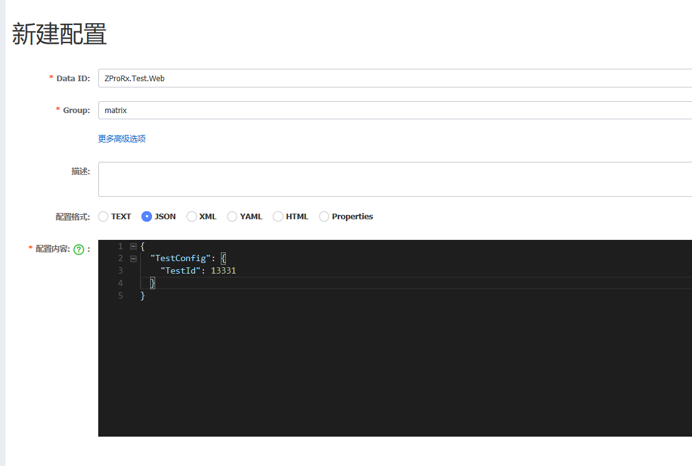

# ZP.Lib.Standard

## Nacos集成

有关详细的说明，请参考以下官网
https://nacos.io/zh-cn/docs/contributing.html

支持动态更新

ListenConfigurationBgTask 用于监控Config的变更。

###  新建立配置

以我的空间的例子如下：

http：//49.233.89.69:8848/nacos

---

[返回ZP.Lib](../Readme.md)