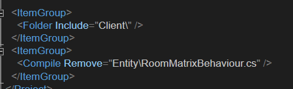
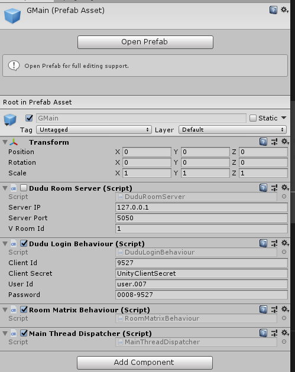
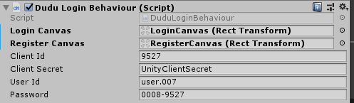
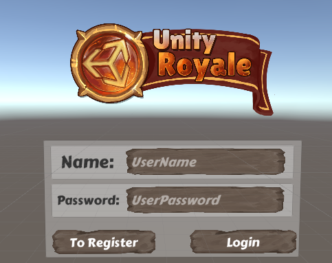

# ZP.Lib.Unity.Plugin

## 概要
完全给提供给Unity Client端使用，以Plugin 形式注入到Unity工程中。
包括一些常用的Prefab、Demo Scene、以及封装代码组成。


## RoomMatrixBehaviour
RoomMatrixBehaviour 类它是场景的基本组成
完成一些应用与场景的主要配置工作，它是在Unity场景中GameObject获取的Channel、Pipeline的方式。
它也是Room套间的单体，当然在Unity Client端其是普通的单体。

分为两个
一个用于Client 端，定义在 ZP.Lib.Matrix中，这个类是不会在Server端进行编译



其主要功能：
- 切换Room

一个用于Server端，定义在ZP.Lib.Soc中，这里就会被编译

RoomServerBehaviour，不会被自动生成到Server端的场景中。

## [Login/logoff]

对接Matrix.Inspector服务，返回Token，并对Token进行管理，如果过期会自动进行重新连接。
这里Token由框架进行保存，Login直接返回应用数据，本案例的数据由 ZP.WebServer.Demo.TestLoginController 返回
参数类型为 ZPropertyPairPart2<string, ZRoom> string 类型用于测试。

在《Dudu》实例中其返回的数据为`Darder`类，主要用于保存当前Darder（玩家）的卡片内容。

## Login Scene

定义 Login 场景类，需要从LoginBehaviour<LData>派生。它是整体程序的入口。
其会自动绑定上RoomMatrixBehaviour 类。通过它可以切换到不同的房间。

[TODO]
正常还应该返回 UserData等内容。

## Prefabs
[TODO] 
[2019-12-08] 
可能会放在Plugin的模块中进行提供(ZProRx.Matrix) 暂定名

1. 各UIItem的Prefabs例子需要进行定义


## GameObject/Prefab

### GMain
结构参考如下：



- DuduLoginBehaviour 从上面[Login/Logoff](#loginlogoff) 的LoginBehaviour<LData>派生，用于登录到游戏或项目中



需要指定加，LoginCanvas对应的GameObject对象。如下图所示：



- RoomServerBehaviour 参考 [](#roommatrixbehaviour) 用于各room的管理以及加载切换等。
- DuduRoomServer 为RoomServer类，即房间类，从RoomServerBehaviour 派生，其默認為非enable状态， 后续由 RoomServerBehaviour 負責加載与初始化。


### BattleMain-Dudu
为主Battle类，用于Battle的构建。

- DuduRoundBattleBuilder 用于构建Battle，向后端请求战场数据。
- ZWorldBehaviour 用于定义场景坐标轴，本例为3转2场景。目前框架中还支持其它的坐标系统，后续扩展中。
- Ground 子对象，代表整体物理世界模型。
- BoxCollider 用于包含整体的Box。
- 为了用户的交互性能，可以设置一个单独的Layer ，比如 Ground

### MainBuilder
主UI类，用于构建用户主要的信息，比如：卡片列表、玩家信息、任务项等。
是应用的主要入口。

- XXXMainBuilder 主要构建类，由ZPropertyViewRootBehaviour 派生，一般用于把对玩家类进行绑定,《Dudu》中对应的是`DuduMainBuilder`类。


### Unit 操作单元
一般通过动态构建出来，对应的ZP类为`IBattleUnit`

`BaseBattleViewItem` Unit的表示类，一般通过Attribute注入。
参考如下`DUnit`的定义，
```csharp

    [PropertyUIItemResClassAttribute("Dudu/", "", ".CardProp.ModelName")]
    [PropertyAddComponentClass(typeof(RTDUnitObj))]
    public class DUnit :
    ZBattle.BaseBattleUnit,
    ZBattle.IBattleUnit,
    ZBattle.IEquipable,
    ZBattle.ISkillable,
    ZBattle.IMovable

```
其中 `PropertyUIItemResClassAttribute` Attribute 指定对应的Prefab类，在Battle或者应用加载过程中，会根据Prefab动态创建出Unit单元。
同时追加对应的View表示类，`PropertyAddComponentClass` 指定表示类的Type。

`BaseBattleViewItem` 基本的方法为 `OnAttackHit`，由武器类进行触发并调用。最终调用

```csharp
unit.BeAttacked (attacker);
```
参考如下时序图[TODO] [2019-12-20]


## 数值系统

//[TODO]


## 代码说明

一个应用最小的模块定义

基础类
- Dard：卡片类
- DardLink: 用于定义卡片关联的数据类，一般用于与用户的关联
- DuduLoginBehaviour: 用于登录到系统
- DuduRoomServer：房间类，参考 [GMain](#gmain)

场景构建
- DuduMainBuilder：用于Build 主场景
- DuduRoundBattleBuilder： 用于Build 主战斗场景

回合战场
- DUnit: 战斗单位
- DuduBattlePipeline: 战斗类


## 流程说明

### Login流程

[TODO] [2019-12-14]

1. 最小依赖，需要先 对应的Login Server ，如果使用Matrix，其Server为 [ZP.Matrix.Inspector](../../ZP.Matrix/ZP.Matrix.Inspector/Readme.md)

其需要先进行 重定向设置，参考以上对应文档中的内容就可以进行设置了。

2. 调用应用本身的用于接收用户应用登录重定向调用。可以是专用，也可以是通用的Server。如`ZP.WebServer.Demo`
3. 