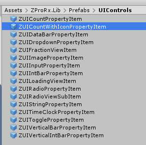
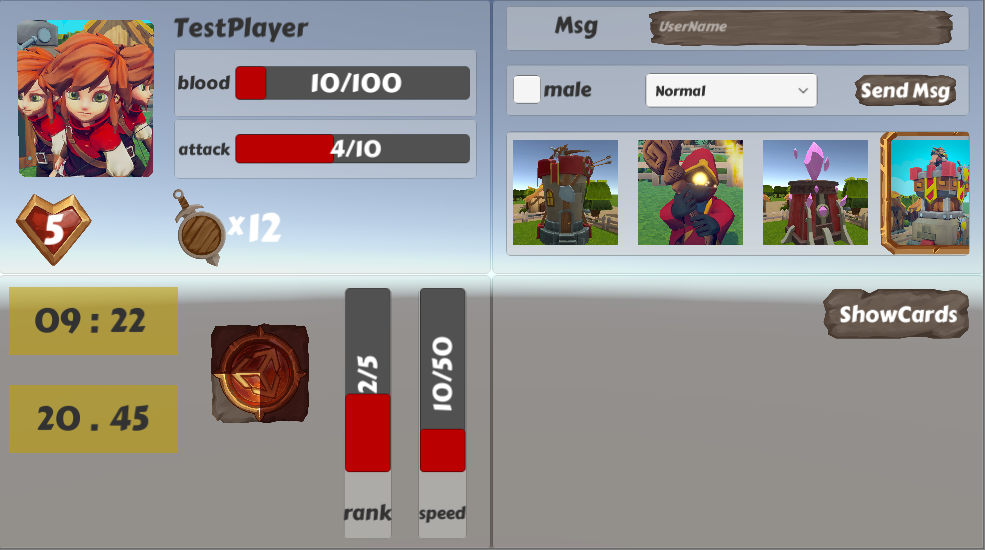

# ZProRx.Lib Plugin

这是一个Unity的PluginPackage。

主要包括了ZP中一些预定义的Prefab，以提升使用ZP的效果和体验。

## Prefab

### 主要Prefabs
- ZUIBarPropertyItem ：支持ZProperty< ZDataBar >
- ZUIInputPropertyItem ： 支持ZProperty< ZIntBar >
- ZUICountPropertyItem : 支持ZProperty< int >
- ZUIDropdownPropertyItem : 支持ZProperty< Enum >, multiEnum 暂时未支持
- ZUIExpPropertyItem : 支持ZProperty< ZExp >
- ZUIImagePropertyItem : 加载 Property.ToString 为资源名的Sprite对象。可以通过成员Attribute [PropertyImageResAttribute] 修饰定义资源路径。
- ZUIImageStatusPropertyItem： 与ZUIImagePropertyItem类似
- ZUIPositionPropertyItem：支持 Vector2 / ZTransform Property
- ZUIProgressPropertyItem： 支持ZProperty< float >
- ZUIPropertyListItem ：支持ZPropertyList 和 ZPropertyRefList
- ZUIRadioPropertyItem： Enum Property 和 int Property Link with List Property(ZPropertyList 和 ZPropertyRefList)
- ZUITextPropertyItem: 显示 Property.ToString
- ZUITimeClockPropertyItem：用于显示时间，支持ZDateTime 和 int类型的Property

所在位置如下所示：

### Prefab的引用
1. 可以直接加摆放到场景或者UI中
2. 对于需要动态创建的Prefabs，推荐使用Prefab变体的方式进行。一定要注意变体的同步问题。

## Asset
Resources资源目录结构如下，这里与Server也使用相同的目录结构。

几个相对固定的目录：
- Msgs: Msg/msgIcon 用于ZMsgList的动态加载的Prefab定义，可以参考它进行对应的Msg体的自定义。
- Jsons
  - Server： Server端的场景与预制的定义位置，用于Server端。
  - Config： ZPConfig的自动加载目录
  - [Card]s: 用于ZP.Lib.Card的ZCardFactory 自动加载对应的卡片资源。

## Demo 说明

- UI控制Demo：
Assets/ZProRx.Lib/Scenes/BasePropertyUIStage 

运行场景如下：

## 参考

[ZP.Lib](../../../ZP.Lib/ZP.Lib.Main/Readme.md)