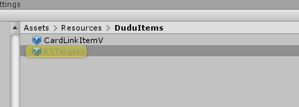

# ZProRx.Lib Plugin

这是一个Unity的PluginPackage。

主要包括了ZP中一些预定义的Prefab，以提升使用ZP的效果和体验。

## Plugin 配置
按如下步骤进行配置并导入Package

1. 包含依赖UniRx，如果需要最新版本自行下载并安装更新。可以在Assets Store 搜索 UniRx。

2. 导入ZProRx.Lib Plugin Package
最新版本可以到 https://github.com/bennychao/ZProRx.Lib/Publish/ZProRx.Lib.package 下载。后续会放到AssetStore中。

导入内容包含：
Assets/ZProRx.Lib
Assets/Plugins/ZP.Lib/ZP.Lib.Main

依赖并集成两个第三方Plugin
/Plugins/LitJson.dll
/Plugins/M2Mqtt.dll

1. 导入后，需要在工程设置（PlayerSetting）中追加如下宏定义，才能正常使用。
ZP_UNITY_CLIENT;ZP_UNIRX;ZP_M2MQTT 

## Prefab

### 主要Prefabs
- ZUIBarPropertyItem ：支持ZProperty< ZDataBar >
- ZUIInputPropertyItem ： 支持ZProperty< ZIntBar >
- ZUICountPropertyItem : 支持ZProperty< int >
- ZUIDropdownPropertyItem : 支持ZProperty< Enum >, multiEnum 暂时未支持
- ZUIExpPropertyItem : 支持ZProperty< ZExp >
- ZUIImagePropertyItem : 加载 Property.ToString 为资源名的Sprite对象。可以通过成员Attribute [PropertyImageResAttribute] 修饰定义资源路径。
- ZUIImageStatusPropertyItem： 与ZUIImagePropertyItem类似
- ZUIPositionPropertyItem：支持 Vector2 / ZTransform Property
- ZUIProgressPropertyItem： 支持ZProperty< float >
- ZUIPropertyListItem ：支持ZPropertyList 和 ZPropertyRefList
- ZUIRadioPropertyItem： Enum Property 和 int Property Link with List Property(ZPropertyList 和 ZPropertyRefList)
- ZUITextPropertyItem: 显示 Property.ToString
- ZUITimeClockPropertyItem：用于显示时间，支持ZDateTime 和 int类型的Property

所在位置如下所示：

### Prefab的引用
1. 可以直接加摆放到场景或者UI中
2. 对于需要动态创建的Prefabs，推荐使用Prefab变体的方式进行。一定要注意变体的同步问题。

## Asset
Resources资源目录结构如下，这里与Server也使用相同的目录结构。

为方便不同的应用的资源管理，ZPR使用如下的目录结构
应用Root目录：Asset/Resources/[AppName]/

几个相对固定的目录：
- Msgs: Msg/msgIcon 用于ZMsgList的动态加载的Prefab定义，可以参考它进行对应的Msg体的自定义。
- Jsons
  - Server： Server端的场景与预制的定义位置，用于Server端。
  - Config： ZPConfig的自动加载目录
  - [Card]s: 用于ZP.Lib.Card的ZCardFactory 自动加载对应的卡片资源。

## Demo 说明

1.  UI Controls Demo：
 - 场景位置：Assets/ZProRx.Lib/Scenes/BasePropertyUIStage.unity

 - 运行场景：

2. TestSocketStage: 
  用于连接Socket Server的Demo， 
  场景位置：Assets/ZProRx.Lib/Scenes/TestSocketStage.unity
  需要先运行 ZProRx.Test.Server，依赖NetCore3.1 以上环境。
 - 下载并编译源代码：源代码 https://github.com/bennychao/ZProRx.Lib
 - 切换到目录：\ZProRx.Test.Server\bin\Release\netcoreapp3.1
  
 - 运行命令：
    Windows:
    dotnet .\ZProRx.Test.Soc.dll '{\"WorkerParam\":\"run\",\"Port\":5050,\"UnitType\":\"hall\",\"Count\":2,\"IsPrivateClub\":true}'

    Mac:
    dotnet ./ZProRx.Test.Soc.dll '{"WorkerParam":"run","Port":5050,"UnitType":"hall","Count":2,"IsPrivateClub":true}'
  
  运行效果如下：

 - 最后再启动场景

1. TestWebStage: 
用于连接Web API的Demo， 
场景位置：Assets/ZProRx.Lib/Scenes/TestSocketStage.unity
需要先运行 ZProRx.Test.Web，依赖NetCore3.1 以上环境。
 - 下载并编译源代码：源代码 https://github.com/bennychao/ZProRx.Lib
 - 切换到目录：\ZProRx.Test.Web\bin\Release\netcoreapp3.1
 - 运行命令：dotnet .\ZProRx.Test.Web.dll

4. TestCardsStage 
用于演示Card的升级、抽卡等流程。

[TODO] Demo构建中

## 参考

[ZP.Lib](../../../ZP.Lib/ZP.Lib.Main/Readme.md)

## Release Note

Decline reasons:
Package Content - English 
There must be an English version of documentation and metadata description text in your submission. Please have an English version of your title, metadata description, documentation, and content of your package.(https://unity3d.com/asset-store/sell-assets/submission-guidelines , Section 3.1.b, 3.2.f)
Metadata & Artwork - Use HTML Tags 
You must use HTML tags in your metadata description text. Please use the following tags to format your metadata description text: To create a new line, use tag 
at the end To insert a web link in the description, follow this format: Link text To insert a email link in the description, follow this format: Link text (https://unity3d.com/asset-store/sell-assets/submission-guidelines , Section 2.3.e)